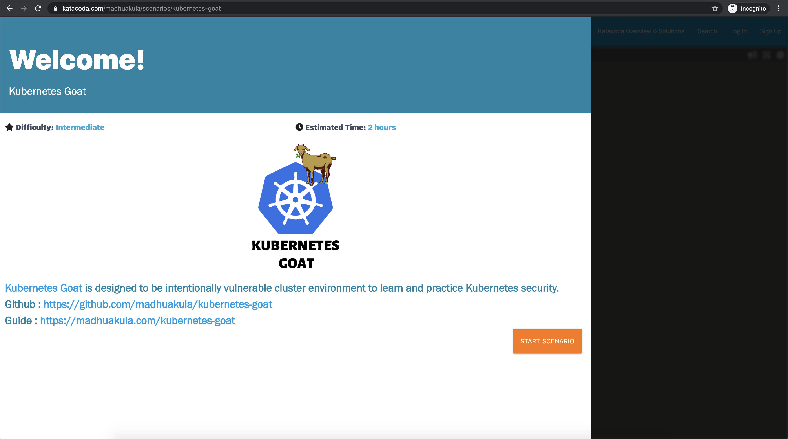
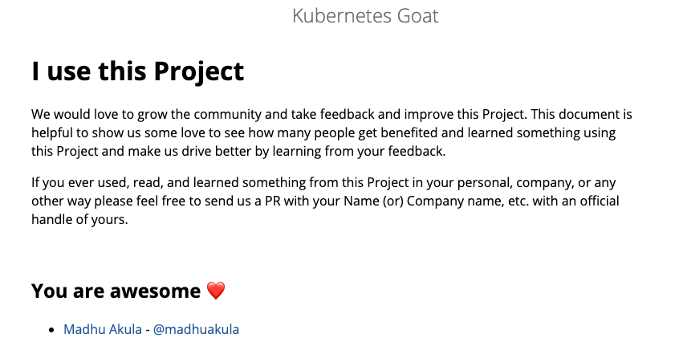

<p align="center">
  <a href="https://madhuakula.com/kubernetes-goat">
    
  </a>
</p>
<h1 align="center">
  Kubernetes Goat
</h1>
<p align="center">
    ✨ The Kubernetes Goat is designed to be an intentionally vulnerable cluster environment to learn and practice Kubernetes security.
</p>

<p align="center">
    🙌 Refer to <a href="https://madhuakula.com/kubernetes-goat">https://madhuakula.com/kubernetes-goat</a> for the guide 📖
</p>

<p align="center">
    <a href="https://app.netlify.com/sites/kubernetes-goat/deploys">
        
    </a>    
    <a href="https://github.com/madhuakula/kubernetes-goat/blob/master/LICENSE">
        
    </a>    
    <a href="https://github.com/madhuakula/kubernetes-goat/releases/latest">
        
    </a>    
    <a href="https://github.com/madhuakula/kubernetes-goat/stargazers">
        
    </a>    
    <a href="https://github.com/madhuakula/kubernetes-goat/pulls">
        
    </a>    
    <a href="https://hub.docker.com/r/madhuakula/k8s-goat-system-monitor">
        
    </a>    
    <a href="https://twitter.com/intent/tweet/?text=Kubernetes%20Goat,%20an%20intentionally%20vulnerable%20by%20design%20training%20platform%20to%20learn%20%23Kubernetes%20Security%20by%20%40madhuakula.%20Check%20it%20out%20&url=https://github.com/madhuakula/kubernetes-goat">
        
    </a>    
</p>

[](https://madhuakula.com/kubernetes-goat)

## Recent Kubernetes Goat Presentations

**OWASP Bay Area Meetup**

[](https://youtu.be/DQllxpb46Yw)

**DEFCON Red Team Village**

[](https://youtu.be/aEaSZJRbnTo)

## 🎲 Just click and Play in the browser for free using Katacoda Playground - [Try now]((https://katacoda.com/madhuakula/scenarios/kubernetes-goat))

[](https://katacoda.com/madhuakula/scenarios/kubernetes-goat)

[https://katacoda.com/madhuakula/scenarios/kubernetes-goat](https://katacoda.com/madhuakula/scenarios/kubernetes-goat)

## ⚙️ Setting up Kubernetes Goat

* Before we set up the Kubernetes Goat, ensure that you have created and have admin access to the Kubernetes cluster

```bash
kubectl version --short
```

* Set up the helm version 3 in your path as `helm`. Refer to helm [releases](https://github.com/helm/helm/releases) for more information about setup

```bash
helm version --short
```

* Then finally setup Kubernetes Goat by running the following command

```bash
git clone https://github.com/madhuakula/kubernetes-goat.git
cd kubernetes-goat
bash setup-kubernetes-goat.sh
```

* To export the ports/services locally to start learning, run the following command

```bash
bash access-kubernetes-goat.sh
```

* Then navigate to [http://127.0.0.1:1234](http://127.0.0.1:1234)

### Kubernetes Goat - KIND setup

* If you want to setup Kubernetes Goat using KIND, refer to [kind-setup](kind-setup/README.md)

## 🏁 Scenarios

1. Sensitive keys in codebases
2. DIND (docker-in-docker) exploitation
3. SSRF in the Kubernetes (K8S) world
4. Container escape to the host system
5. Docker CIS benchmarks analysis
6. Kubernetes CIS benchmarks analysis
7. Attacking private registry
8. NodePort exposed services
9. Helm v2 tiller to PwN the cluster - [Deprecated]
10. Analyzing crypto miner container
11. Kubernetes namespaces bypass
12. Gaining environment information
13. DoS the Memory/CPU resources
14. Hacker container preview
15. Hidden in layers
16. RBAC least privileges misconfiguration
17. KubeAudit - Audit Kubernetes clusters
18. Falco - Runtime security monitoring & detection
19. Popeye - A Kubernetes cluster sanitizer
20. Secure network boundaries using NSP

## ❤️ Showcase

* Presented at OWASP Bay Area Meetup at [https://youtu.be/DQllxpb46Yw](https://youtu.be/DQllxpb46Yw)
* Presented at DEF CON RED Team Village [https://youtu.be/aEaSZJRbnTo](https://youtu.be/aEaSZJRbnTo)
* Presented at OWASP San Diego at [https://www.meetup.com/Open-Web-Application-Security-Project-San-Diego-OWASP-SD/events/hmbbkrybckbvb/](https://www.meetup.com/Open-Web-Application-Security-Project-San-Diego-OWASP-SD/events/hmbbkrybckbvb/)
* Featured in the official Kubernetes Podcast at [https://kubernetespodcast.com/episode/109-kubermatic](https://kubernetespodcast.com/episode/109-kubermatic/)
* Featured in tl;dr sec [https://tldrsec.com/blog/tldr-sec-039](https://tldrsec.com/blog/tldr-sec-039/)
* Featured in CloudSecList [https://cloudseclist.com/issues/issue-42](https://cloudseclist.com/issues/issue-42/)
* Presented at EkoParty 2020 DevSecOps [https://youtu.be/XqwbVU-gtng](https://youtu.be/XqwbVU-gtng)
* Presented at c0c0cn 2020 [https://india.c0c0n.org/2020/speakers#madhu_akula](https://india.c0c0n.org/2020/speakers#madhu_akula)
* Featured in Info Ck YouTube channel [https://youtu.be/5ojho4L6Xfo](https://youtu.be/5ojho4L6Xfo)
* Presented in Cloud Native Indonesia Meetup [https://youtu.be/pf5jOGWoWU0](https://youtu.be/pf5jOGWoWU0)
* Presented in [USENIX LISA 2021 Closing Note](https://www.usenix.org/conference/lisa21/presentation/closing)
* Presented in SANS CloudSecNext Summit 2021

## ⚠️ Disclaimer

> Kubernetes Goat creates intentionally vulnerable resources into your cluster. DO NOT deploy Kubernetes Goat in a production environment or alongside any sensitive cluster resources.

> Kubernetes Goat comes with absolutely no warranties whatsoever. By using Kubernetes Goat, you take full responsibility for all outcomes that result.

## Show us some ❤️

Please feel free to send us a [PR](https://github.com/madhuakula/kubernetes-goat/blob/master/guide/src/getting-involved/i-use-this-project.md) and show some ❤️

[](https://github.com/madhuakula/kubernetes-goat/blob/master/guide/src/getting-involved/i-use-this-project.md)

## License

[MIT](https://github.com/madhuakula/kubernetes-goat/blob/master/LICENSE)

## ✨ Acknowledgements

Thanks goes to these wonderful people 🎉

<table><tr><td align="center"><a href="https://github.com/madhuakula"><br />madhuakula</a></td><td align="center"><a href="https://github.com/mkcn"><br />mkcn</a></td><td align="center"><a href="https://github.com/macagr"><br />macagr</a></td><td align="center"><a href="https://github.com/rewanthtammana"><br />rewanthtammana</a></td><td align="center"><a href="https://github.com/avicoder"><br />avicoder</a></td><td align="center"><a href="https://github.com/NF997"><br />NF997</a></td></tr><tr><td align="center"><a href="https://github.com/smoyer64"><br />smoyer64</a></td><td align="center"><a href="https://github.com/wurstbrot"><br />wurstbrot</a></td><td align="center"><a href="https://github.com/podjackel"><br />podjackel</a></td><td align="center"><a href="https://github.com/ant4g0nist"><br />ant4g0nist</a></td></tr></table>
