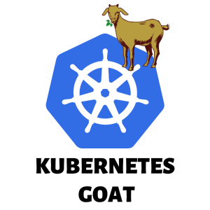
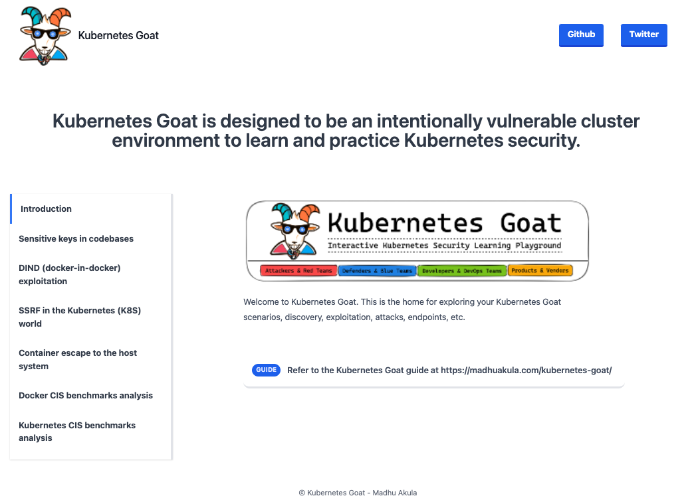
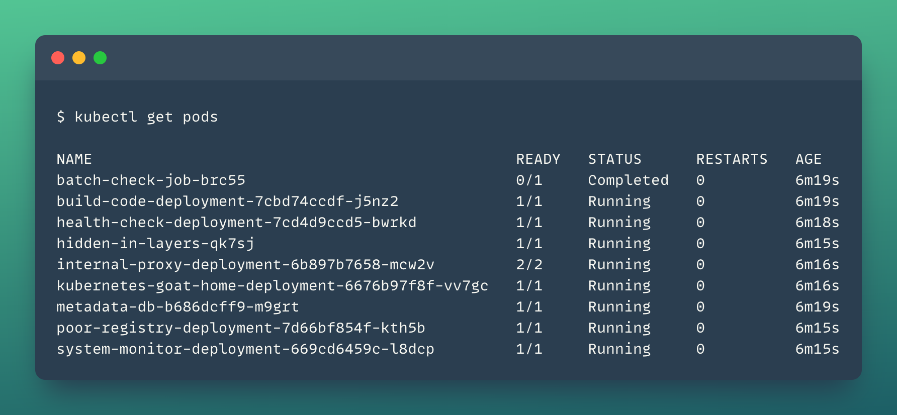
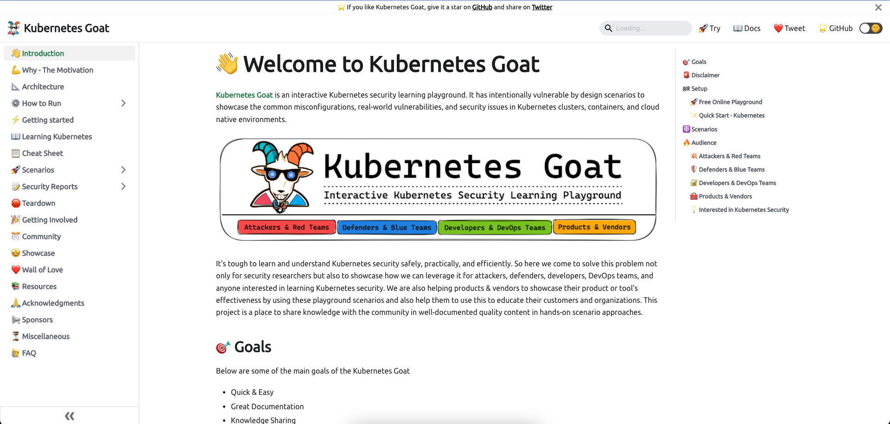

<p align="center">
  <a href="https://madhuakula.com/kubernetes-goat">
    
  </a>
</p>
<h1 align="center">
  Kubernetes Goat
</h1>
<p align="center">
    ✨ The Kubernetes Goat is designed to be an intentionally vulnerable cluster environment to learn and practice Kubernetes security 🚀
</p>

<p align="center">
    🙌 Refer to <b><a href="https://madhuakula.com/kubernetes-goat">https://madhuakula.com/kubernetes-goat</a></b> for the guide 📖
</p>

<p align="center">
    <a href="https://app.netlify.com/sites/kubernetes-goat/deploys">
        
    </a>    
    <a href="https://github.com/madhuakula/kubernetes-goat/blob/master/LICENSE">
        
    </a>    
    <a href="https://github.com/madhuakula/kubernetes-goat/releases/latest">
        
    </a>    
    <a href="https://github.com/madhuakula/kubernetes-goat/stargazers">
        
    </a>    
    <a href="https://github.com/madhuakula/kubernetes-goat/pulls">
        
    </a>    
    <a href="https://hub.docker.com/r/madhuakula/k8s-goat-system-monitor">
        
    </a>    
    <a href="https://twitter.com/intent/tweet/?text=Kubernetes%20Goat,%20an%20intentionally%20vulnerable%20by%20design%20training%20platform%20to%20learn%20%23Kubernetes%20Security%20by%20%40madhuakula.%20Check%20it%20out%20&url=https://github.com/madhuakula/kubernetes-goat">
        
    </a>
    <a href="https://rebrand.ly/Kubernetes-Goat/">
        
    </a>
</p>

[](https://madhuakula.com/kubernetes-goat)

## ⚙️ Setting up Kubernetes Goat

* Ensure you have admin access to the Kubernetes cluster and installed `kubectl`. Refer to the [docs for installation](https://kubernetes.io/docs/tasks/tools/install-kubectl/)

* Ensure you have the `helm` package manager installed. Refer to the [docs for installation](https://helm.sh/docs/intro/install)
* To set up the Kubernetes Goat resources in your cluster, run the following commands:

```bash
git clone https://github.com/madhuakula/kubernetes-goat.git
cd kubernetes-goat
chmod +x setup-kubernetes-goat.sh
bash setup-kubernetes-goat.sh
```

* Ensure the pods are running before running the access script

```bash
kubectl get pods
```



* Access Kubernetes Goat by exposing the resources to the local system (port-forward) by the following command:

```bash
bash access-kubernetes-goat.sh
```

* Then navigate to [`http://127.0.0.1:1234`](http://127.0.0.1:1234)


> Refer to [https://madhuakula.com/kubernetes-goat/docs/how-to-run](https://madhuakula.com/kubernetes-goat/docs/how-to-run) for setting up Kubernetes Goat in various environments like GKE, EKS, AKS, K3S, KIND, etc.


## 🏆 Scenarios

1. Sensitive keys in codebases
2. DIND (docker-in-docker) exploitation
3. SSRF in the Kubernetes (K8S) world
4. Container escape to the host system
5. Docker CIS benchmarks analysis
6. Kubernetes CIS benchmarks analysis
7. Attacking private registry
8. NodePort exposed services
9. Helm v2 tiller to PwN the cluster - [Deprecated]
10. Analyzing crypto miner container
11. Kubernetes namespaces bypass
12. Gaining environment information
13. DoS the Memory/CPU resources
14. Hacker container preview
15. Hidden in layers
16. RBAC least privileges misconfiguration
17. KubeAudit - Audit Kubernetes clusters
18. Falco - Runtime security monitoring & detection
19. Popeye - A Kubernetes cluster sanitizer
20. Secure network boundaries using NSP

## 📖 Documentation Guide

Here is the detailed step by step guide for learning and using Kubernetes Goat 🎉: [documentation guide] (https://madhuakula.com/kubernetes-goat)

[](https://madhuakula.com/kubernetes-goat)

**Reference: [https://madhuakula.com/kubernetes-goat](https://madhuakula.com/kubernetes-goat)**

## ⚠️ Disclaimer

> Kubernetes Goat has intentionally created vulnerabilities, applications, and configurations to attack and gain access to your cluster and workloads. Please **DO NOT** run this alongside your production environments and infrastructure. We highly recommend running this in a safe and isolated (contained) environment.

> Kubernetes Goat is used for educational purposes only. Do not test or apply these attacks on any systems without permission. Kubernetes Goat comes with absolutely no warranties, by using it you take full responsibility for all outcomes.

## 📝 License

[MIT](https://github.com/madhuakula/kubernetes-goat/blob/master/LICENSE)

## ✨ Acknowledgements

Thanks to to these wonderful people: 🎉

<table>
    <tr>
        <td align="center"><a href="https://github.com/madhuakula"><br />madhuakula</a></td>
        <td align="center"><a href="https://github.com/apvarun"><br />apvarun</a></td>
        <td align="center"><a href="https://github.com/ant4g0nist"><br />ant4g0nist</a></td>
        <td align="center"><a href="https://github.com/phpsystems"><br />phpsystems</a></td>
        <td align="center"><a href="https://github.com/adamhurm"><br />adamhurm</a></td>
        <td align="center"><a href="https://github.com/malwareowl"><br />malwareowl</a></td>
    </tr>
    <tr>
        <td align="center"><a href="https://github.com/mkcn"><br />mkcn</a></td>
        <td align="center"><a href="https://github.com/0xCardinal"><br />0xCardinal</a></td>
        <td align="center"><a href="https://github.com/macagr"><br />macagr</a></td>
        <td align="center"><a href="https://github.com/rewanthtammana"><br />rewanthtammana</a>
        </td>
        <td align="center"><a href="https://github.com/avicoder"><br />avicoder</a></td>
        <td align="center"><a href="https://github.com/apps/dependabot"><br />dependabot[bot]</a>
        </td>
    </tr>
    <tr>
        <td align="center"><a href="https://github.com/AmeerAssadi"><br />AmeerAssadi</a></td>
        <td align="center"><a href="https://github.com/NF997"><br />NF997</a></td>
        <td align="center"><a href="https://github.com/smoyer64"><br />smoyer64</a></td>
        <td align="center"><a href="https://github.com/suneshgovind"><br />suneshgovind</a></td>
        <td align="center"><a href="https://github.com/wurstbrot"><br />wurstbrot</a></td>
        <td align="center"><a href="https://github.com/shivankar-madaan"><br />shivankar-madaan</a></td>
    </tr>
    <tr>
        <td align="center"><a href="https://github.com/bzd111"><br />bzd111</a></td>
        <td align="center"><a href="https://github.com/hexachordanu"><br />hexachordanu</a></td>
        <td align="center"><a href="https://github.com/podjackel"><br />podjackel</a></td>
        <td align="center"><a href="https://github.com/ravenium"><br />ravenium</a></td>
    </tr>
</table>
