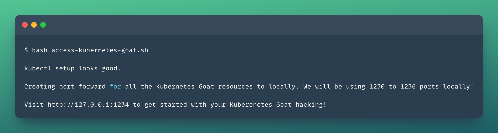

# ⚡ Getting Started with Kubernetes Goat

This document contains how you can get started with accessing the Kubernetes Goat home after the setup of the cluster and the resources. The below section contains step-by-step instructions to expose the Kubernetes Goat scenarios to the localhost for exploring, and learning further.

:::tip

Ensure you have `kubectl` and `docker` binary installed in your host system to get the maximum out of this training platform. Follow each scenario by clicking on the scenario.

:::

### Access Kubernetes Goat home

:::info

Here we are going to expose the running pods and deployments locally using the `port-forward` command to locally access the Kubernetes Goat resources.

:::

* If you have not already setup or deployed the Kuberntes Goat resources into your cluster, refer to [How to run Kubernetes Goat](how-to-run/kubernetes)

* Ensure the pods are running before running the access script

```bash
kubectl get pods
```


* Run the following command to access the environment by exposing the services via `port-forward`. Make sure you are running this command from the `Kubernetes-goat` home directory

```bash
bash access-kubernetes-goat.sh
```



* Then navigate to [`http://127.0.0.1:1234`](http://127.0.0.1:1234)


