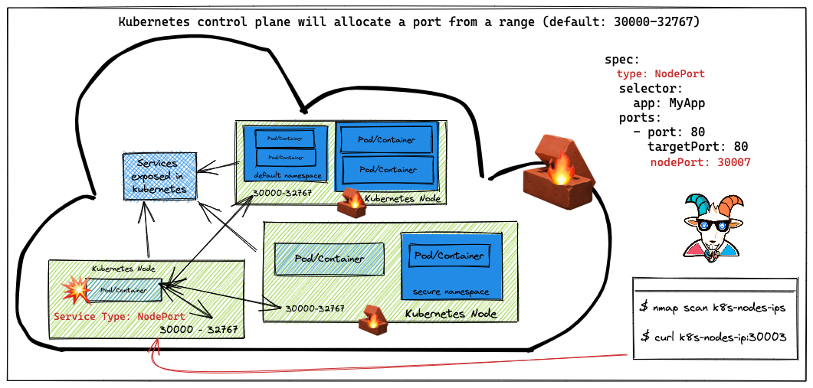

# ⎈ NodePort exposed services

## 🙌 Overview

In this scenario, we see another misconfiguration that may give attackers access to internal services and non-exposed services. This is one of the simple misconfigurations made when creating the Kubernetes services and also the cluster setup and configurations.



By the end of the scenario, we will understand and learn the following

1. How Kubernetes `NodePort` works, configuration, and the ranges
2. Performing the portscan and interacting with Kubernetes nodes

### ⚡️ The story

If any of the users exposed any service within the Kubernetes cluster with `NodePort`, this means that the nodes where the Kubernetes clusters are running don't have any firewall/network security enabled. We need to see some unauthenticated and unauthorized services.

:::info

To get started with the scenario, run the following command and look for Kubernetes nodes external IP addresses

```bash
kubectl get nodes -o wide
```

:::

:::tip

When Kubernetes creates a `NodePort` service, it allocates a port from a range specified in the flags that are defined in your Kubernetes cluster configuration. (By default, these are ports ranging from 30000-32767.)

:::

### 🎯 Goal


:::tip

If you can access the metadata-db service using the public IP address of the node with the NodePort, then you can complete the scenario.

:::

### 🪄 Hints & Spoilers

<details>
  <summary><b>✨ Still looking at the Nodes Public IPs? </b></summary>
  <div>
    <div>Get back to your network pentest days! Start scanning the port default NodePort ranges for the nodes public IPs 🙌</div>
  </div>
</details>

## 🎉 Solution & Walkthrough

### 🎲 Method 1

:::caution

This vulnerability/attack varies depending on how the Kubernetes cluster has been configured. If your Kubernetes cluster is configured with firewalling and blocking the nodes exposed ports, then this scenario might not work for you but the concepts are the same 😊

:::

- Get the list of Kubernetes nodes external IP addresses information by running the following command

```bash
kubectl get nodes -o wide
```


:::tip

Now, let's find out the open ports. In this case, you can use your traditional security scanning utilities like `nmap`

:::

- Once we identified that there is a NodePort exposed, we can just verify by connecting and accessing it

```bash
nc -zv EXTERNAL-IP-ADDRESS 30003
```


- Hooray 🥳 , now we can see that we can access the internal services which are not exposed to the world can be accessed and bypassed due to the `NodePort` configuration

## 🔖 References

- [Kubernetes Services - NodePort](https://kubernetes.io/docs/concepts/services-networking/service/#type-nodeport)
