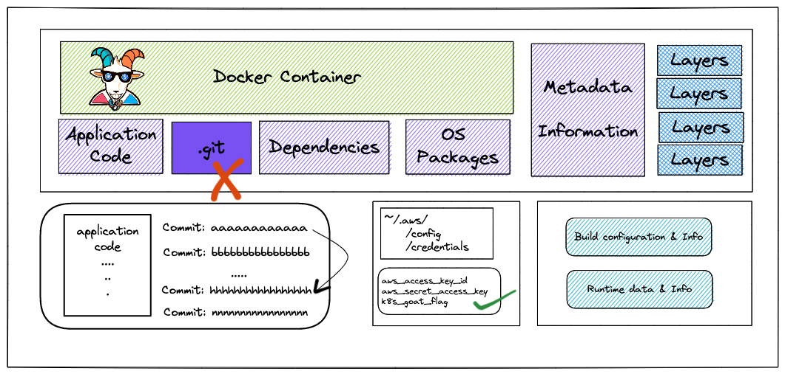
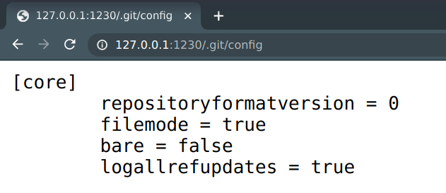
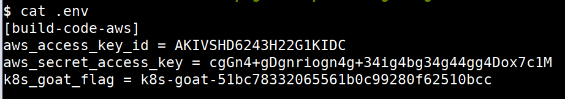
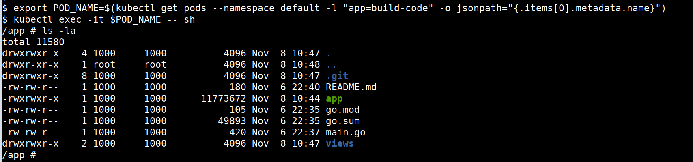

# ⎈ Sensitive keys in codebases

## 🙌 Overview

This scenario is to focus on some popular mistakes by developers & DevOps teams when packaging the artifacts and application codebase. It has real-world impacts like a compromise of organizations and their infrastructure in the wild. 



By the end of the scenario, we will understand and learn the following

1. How to test security misconfigurations in web application entry points
2. Common mistakes or misconfigurations of packaging applications and containers
3. Detecting sensitive keys and information in version control system codebases
4. Using open-source tools to identify and detect secrets

### ⚡️ The story

Developers tend to commit sensitive information to version control systems. As we are moving towards CI/CD and GitOps systems, we tend to forget to identify sensitive information in code and commits. Let's see if we can find something cool here 😀

:::info

To get started with the scenario, navigate to [http://127.0.0.1:1230](http://127.0.0.1:1230)

:::


### 🎯 Goal

The goal of this scenario is to identify the sensitive keys available in the codebase. Which includes the application code, container, and infrastructure.

:::tip

If you obtain the AWS `aws_access_key_id` and `aws_secret_access_key` along with the `k8s-goat-FLAG` flag value then you have completed this scenario.

:::

### 🪄 Hints & Spoilers

<details>
  <summary><b>✨ Still looking at the website? </b></summary>
  <div>
    <div>Always look for the special directories on the website. Tools like Gobuster and DirBuster are quite popular 🙌</div>
  </div>
</details>

<details>
  <summary><b>✨ Found codebase? </b></summary>
  <div>
    <div>Version control systems maintain the history with commits, and we can always go back to one we need 🎉</div>
  </div>
</details>

## 🎉 Solution & Walkthrough

### 🎲 Method 1

* After reading the story and understanding the application by enumeration and discovery, we can perform the discovery and analysis, then we can identify that it has a `.git` folder exposed within the application

* We can navigate to `http://127.0.0.1:1230/.git/config` for verifying that it has a git configuration available



:::tip

We can clone the git repository locally from the remote website using the opensource utilities like [git-dumper](https://github.com/arthaud/git-dumper)

:::

* Ensure you have set up `git-dumper` locally before running the below command. We can clone the git repository by running the following command

```bash
python3 git-dumper.py http://localhost:1230/.git k8s-goat-git
```


* Navigate to the downloaded git repository folder for the analysis

```bash
cd k8s-goat-git
```

* We can verify the git history and information by looking at logs and previous commit history

```bash
git log
```


* We can see that there is a specific commit quite interesting after analyzing multiple commits. We can check out a specific commit using the following command with commit id

```bash
git checkout d7c173ad183c574109cd5c4c648ffe551755b576
```


* Now we are in the specific commit history and we can see all the files, code, resources, and changes available in the specific commit. We can explore the file system and see if any interesting files or changes by using standard Linux utilities

```bash
ls -la
```


* Now we can see an interesting dot file which may look quite suspicious as most of the developers store the environment variables and keys in the similar files

```bash
cat .env
```



* Hooray 🥳 , now we can see that it contains hardcoded AWS keys and our awesome Kubernetes Goat flag as well

### 🎲 Method 2

* Sometimes, we ideally have access to the pods, containers access as part of the audit, or due to some other vulnerability and we can use a different approach to solve or achieve this as well 

* We can use  the following commands to `exec` into the pod

```bash
export POD_NAME=$(kubectl get pods --namespace default -l "app=build-code" -o jsonpath="{.items[0].metadata.name}")
```

```bash
kubectl exec -it $POD_NAME -- sh
```

* As we already inside the pod/container we can perform analysis from within the container as well



:::tip

We can find leaked credentials in git commits/history using open-source utilities like [TruffleHog](https://github.com/trufflesecurity/trufflehog) rather than manual analysis.

:::

* It contains the `.git` folder and we can use `trufflehog` to perform the analysis by running the following command

```bash
trufflehog .
```


* Hooray 🥳 , now we can see that it contains hardcoded AWS keys and our awesome Kubernetes Goat flag as well

## 🔖 References

* [Why we shouldn’t commit secrets into source code repositories](https://littlemaninmyhead.wordpress.com/2021/04/05/why-we-shouldnt-commit-secrets-into-source-code-repositories/)
* [Hunting for secrets in Docker Hub: what we’ve found](https://blog.gitguardian.com/hunting-for-secrets-in-docker-hub/)
