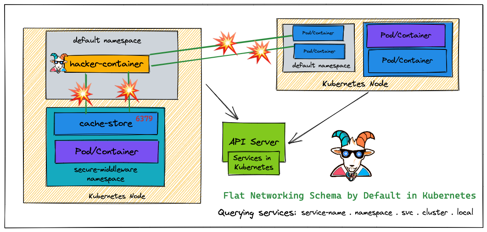
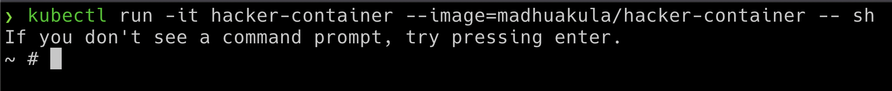
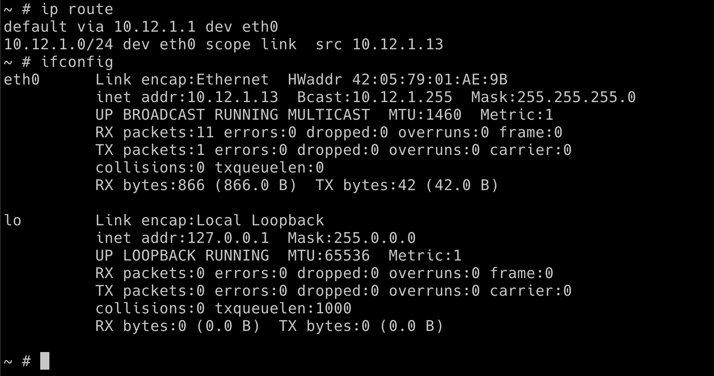
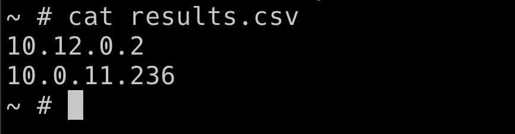

# ⎈ Kubernetes namespaces bypass

## 🙌 Overview

Woah! this is a big misconception in the Kubernetes world. Most people assume that when there are different namespaces in Kubernetes and resources are deployed and managed they are secure and not able to access each other. Many real-world multi-tenant environments are getting exploited and critical resources are exposed internally due to this. By default, Kubernetes comes with flat networking schema and if we need to have segmentation then we have to create them by creating certain boundaries like NSP (network security policies) and others. In this scenario, we see how we can bypass the namespaces and access other namespaces resources.



By the end of the scenario, we will understand and learn the following

1. You will understand the misconception of the Kubernetes namespaces
2. Learn about the Kubernetes networking flat schema and communicating across namespaces
3. Performing the reconnaissance and testing for the network port scanning and vulnerabilities
4. Gaining access to other namespaces resources bypassing the namespaces restrictions

### ⚡️ The story

By default, Kubernetes uses a flat networking schema, which means any pod/service within the cluster can talk to others. The namespaces within the cluster don't have any network security restrictions by default. Anyone in the namespace can talk to other namespaces. We heard that Kubernetes-Goat loves cache. Let's see if we gain access to other namespaces

:::info

* To get started with the scenario, let's run our awesome `hacker-container` in the default namespace

```bash
kubectl run -it hacker-container --image=madhuakula/hacker-container -- sh
```

:::



### 🎯 Goal

:::tip

Gain access to the `cache-store` and obtain the `k8s_goat_flag` flag value to complete this scenario.

:::

### 🪄 Hints & Spoilers

<details>
  <summary><b>✨ Don't see other services? </b></summary>
  <div>
    <div>Let's go back to the old school port scanning, but with <b>zmap</b> with entire cluster range for redis port 🙌</div>
  </div>
</details>

<details>
  <summary><b>✨ Found cache-store service? </b></summary>
  <div>
    <div>Now it's time to read redis docs and get the <b>SECRETSTUFF</b> key 🎉</div>
  </div>
</details>

## 🎉 Solution & Walkthrough

### 🎲 Method 1

* Let's run the `hacker-container` in the default namespace by using the following command to get started

```bash
kubectl run -it hacker-container --image=madhuakula/hacker-container -- sh
```

:::tip

If you don't see the terminal TTY, just press Enter key on your keyboard.

:::

* First, we need to understand the cluster IP range information so that we can use the port scanners to scan the entire cluster range as we don't know which IP address these what services are running

* Some of the simple commands to understand and get more information about the network are as below

```bash
ip route
```

```bash
ifconfig
```

```bash
printenv
```



* Based on the analysis/understanding of the system. We can run the internal scan for the entire cluster range using `zamp` on port 6379 (the default port of Redis - assuming the cache service is Redis, but there is no limit for the testing here, in real-world we see a lot of internal services like ElasticSeach, Mongo, MySQL, etc.)

```bash
zmap -p 6379 10.0.0.0/8 -o results.csv
```

:::note

To run `zmap` on 10.0.0.0/8 you may need adjust the blacklist (/etc/zmap/blacklist.conf) configuration

:::


* Let's look at the results returned from the scan so that we can see if we can access them from the current pod and current namespace



:::tip

There is also another way to access the services/pods in the Kubernetes. For example using the [DNS](https://kubernetes.io/docs/concepts/services-networking/service/#dns) `cache-store-service.secure-middleware` (servicename.namespace).

:::

* As we have identified the IP address of the service, now we can use the default `redis` using client `reds-cli` to talk to the service and explore

```bash
redis-cli -h 10.12.0.2
```

* To get all the available keys

```bash
KEYS *
```

* To get the specific key information using `GET`

```bash
GET SECRETSTUFF
```


:::tip

There are many other services and resources exposed within the cluster like ElasticSearch, Mongo, etc. So if your recon skill is good then you got a gold mine here.

:::

* Hooray 🥳 , now we can see that it contains Kubernetes Goat flag

## 🔖 References

* [Kubernetes Namespaces](https://kubernetes.io/docs/concepts/overview/working-with-objects/namespaces/)
* [Kubernetes Network Policies](https://kubernetes.io/docs/concepts/services-networking/network-policies/)
