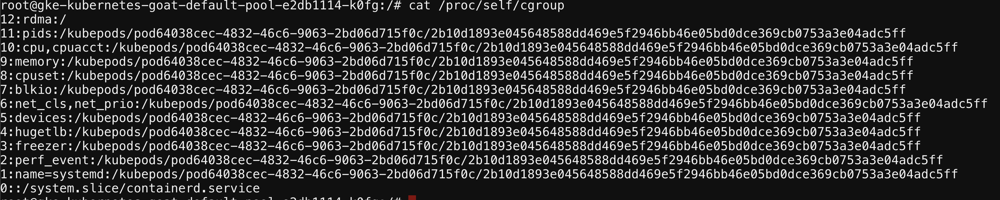

# ⎈ Gaining environment information

## 🙌 Overview

This is no different from the traditional workloads. Most of the compute instances while running the applications store sensitive information like secrets, api_keys, etc. in the environment variables. Similarly, in Kubernetes, most of the people store sensitive information like Kubernetes Secrets and the Config values in the environment variables and if an attacker can find application vulnerabilities like RCE(remote code execution) or command injection then it's game over for that secret.


By the end of the scenario, we will understand and learn the following

1. How to explore the environment variables and analyze
2. Gaining access to sensitive information in the container

### ⚡️ The story

Each environment in Kubernetes will have a lot of information to share. Some of the key things include secrets, API keys, configs, services, and a lot more. So let's go ahead and find the vault key!

:::info

To get started with the scenario, navigate to [http://127.0.0.1:1233](http://127.0.0.1:1233)

:::


### 🎯 Goal

:::tip

Get the `k8s_goat_flag` flag value then you have completed this scenario. This can be found in multiple ways!

:::

### 🪄 Hints & Spoilers

<details>
  <summary><b>✨ Not sure where the environment variables get stored? </b></summary>
  <div>
    <div>Let me take back you to the standard linux utilites and commands like env 🙌</div>
  </div>
</details>

## 🎉 Solution & Walkthrough

### 🎲 Method 1

* We can explore the container by running different commands and understand the system much better. This is more like an exploration scenario to explore the container and understand it better

* We can get the container runtime information by running the below command

```bash
cat /proc/self/cgroup
```



* We can get the information of the container host's information

```bash
cat /etc/hosts
```

* We can get the mount information

```bash
mount
```

* We can also look and explore the file system

```
ls -la /home/
```

* We can access the environment variables, including Kubernetes secrets mounted and service names, ports, etc.

```bash
printenv
```


* Hooray 🥳 , now we can see that it contains the Kubernetes Goat flag which is mounted as a Kubernetes secret inside the pod/container

## 🔖 References

* [Kubernetes Secrets](https://kubernetes.io/docs/concepts/configuration/secret/)
* [Injecting Secrets into Kubernetes Pods via Vault Agent Containers](https://learn.hashicorp.com/tutorials/vault/kubernetes-sidecar)
