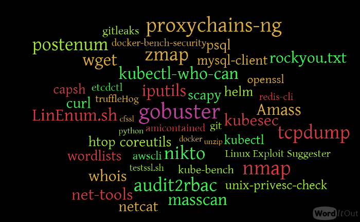
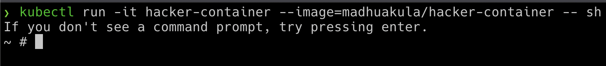
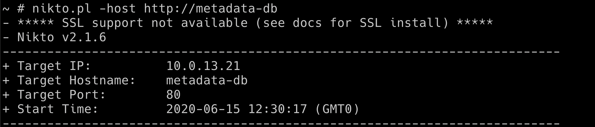

# ⎈ Hacker container preview

## 🙌 Overview

While performing and testing container or Kubernetes infrastructure, we always have to install some common tools inside a container to perform further exploitation and later moved within the cluster. So Hacker Container is a simple alpine-based docker container with commonly used tools and utilities while performing security assessments for containerized and Kubernetes cluster environments.



By the end of the scenario, we will understand and learn the following

1. How to work with hacker-container and explore multiple common security tools, commands
2. Learn to use the hacker container for enumeration, exploitation, and post-exploitation

### ⚡️ The story

This scenario is just an exploration of the common security utilities inside the Kubernetes Cluster environment. I think by this time you might have already used hacker-container multiple times.

:::info

- To get started with this scenario, run the hacker container using the following command

```bash
kubectl run -it hacker-container --image=madhuakula/hacker-container -- sh
```

:::



### 🎯 Goal

:::tip

If you successfully run the hacker container and explore the different tools and utilities available, that pretty much helps you to achieve the goal of this scenario.

:::

### 🪄 Hints & Spoilers

<details>
  <summary><b>✨ Do you still need me? </b></summary>
  <div>
    <div>I think you have all the super powers with you now, go hack 🙌</div>
  </div>
</details>


## 🎉 Solution & Walkthrough

### 🎲 Method 1

:::info

Hacker Container is a utility with a list of useful tools/commands while hacking Kubernetes Clusters. So there is no limit to your exploration of Kubernetes environments. Here we will see some of the most useful and powerful utilities

:::

- We can use a simple and powerful utility like `amicontained` to perform the container introspection and get an overview of the system capabilities, etc.

```bash
amicontained
```


- Performing Nikto scan against internal services using hacker-container

```bash
nikto.pl -host http://metadata-db
```



:::tip

There are many other use cases. To get the maximum out of the hacker container, we can use host privileges, volumes, processes, etc. Will be updated soon with more details.

:::

- Hooray 🥳 , now you have superpowers with you, let's go and hack!

## 🔖 References

- [Hacker Container](https://github.com/madhuakula/hacker-container)

