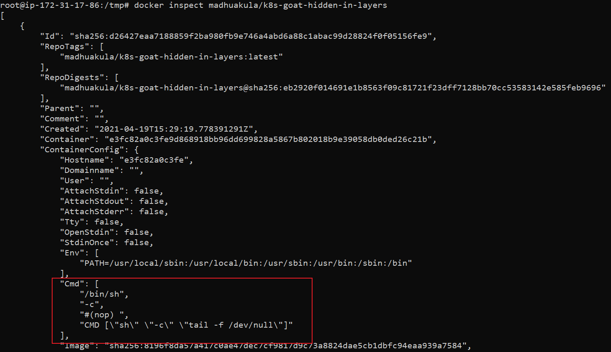
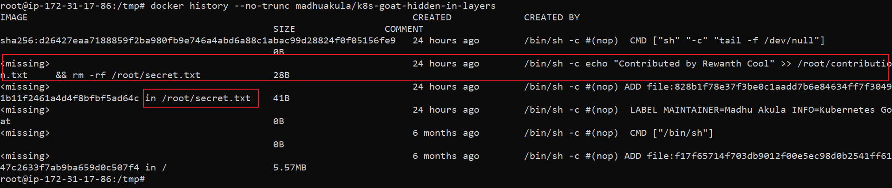
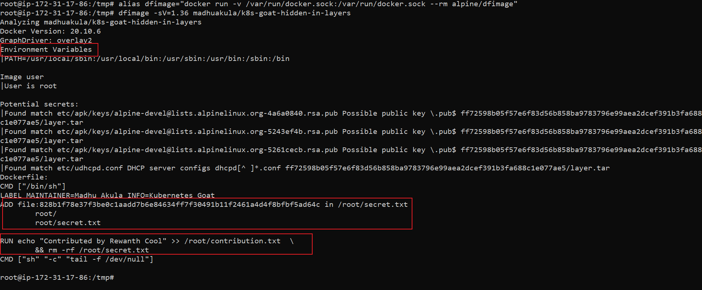
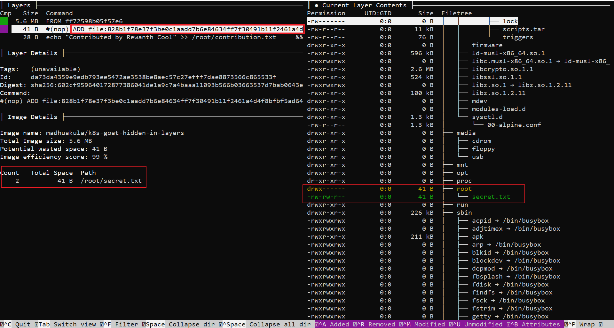
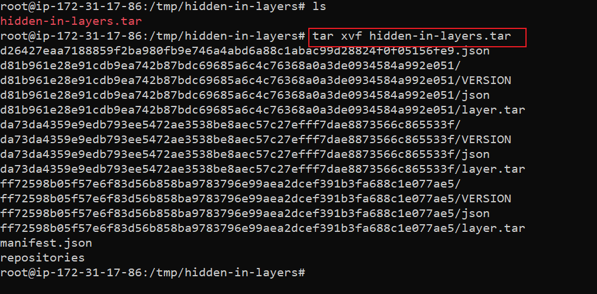
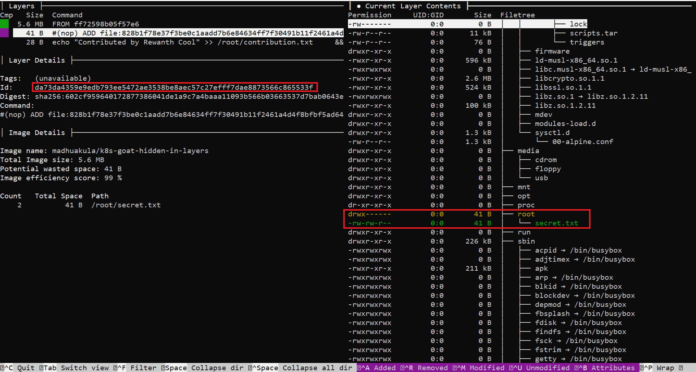
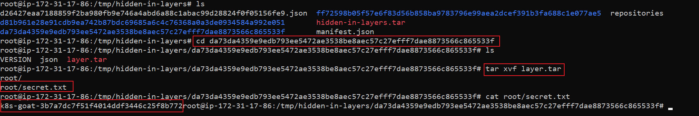

# ⎈ Hidden in layers

## 🙌 Overview

Most of the container images download and used on the internet are created by someone else. If we don't know how they get created (which means if we don't have `Dockerfile`) then I think we might be in trouble sometimes. In this scenario, we can see how to analyze the docker container image layers by using the built-in utilities and also some popular open-source utilities like dive to understand the container image layers.


By the end of the scenario, we will understand and learn the following

1. How to explore, introspect and analyze docker container images
2. Using open source tools like dive to perform container image analysis
3. Able to work with standard command-line utilities

### ⚡️ The story

Sensitive information disclosure is one of the most common vulnerabilities existing in the wild. Mishandling of passwords, private keys, tokens, etc in the containerization world is easy. Here in this scenario, we will analyze and identify one of such mishandled bad practices that leads to sensitive information disclosure.

:::info

- To get started with the scenario, run the following command and explore the `hidden-layers` job

```bash
kubectl get jobs
```

:::


### 🎯 Goal

:::tip

Find the `k8s_goat_flag` flag value in one of the hidden layers of the container, then you have completed this scenario.

:::

### 🪄 Hints & Spoilers

<details>
  <summary><b>✨ Still trying to understand layers? </b></summary>
  <div>
    <div>Explore the default commands like <b>docker history</b>, also popular utilities like <b>dive</b> 🙌</div>
  </div>
</details>

<details>
  <summary><b>✨ Want to get the flag? </b></summary>
  <div>
    <div>We can use <b>docker save</b> command to export the container as a archive file and we can do analysis of each layer 🎉</div>
  </div>
</details>

## 🎉 Solution & Walkthrough

:::info

Try exploring all files, environment variables, etc in the running container. Next, try to analyze the image used above with different tools to find exposed sensitive information.

:::

- Docker CLI is an amazing tool with lots of features, let's start with inspecting the image

```bash
docker inspect madhuakula/k8s-goat-hidden-in-layers
```



- We can observe the `cmd` section in the above output. It shows the default command executed by this image on startup. Though this shows some interesting information, it's not good enough for us

- Maybe it would be more helpful for us if we get to know how this image is built from scratch. For that, we need to analyze the `Dockerfile` of the image. If you have `Dockerfile`, it's good. If not, there are a few ways to analyze it

### 🎲 Method 1

- We can explore each layer by using the default `docker history` command

```bash
docker history --no-trunc madhuakula/k8s-goat-hidden-in-layers
```



### 🎲 Method 2

- We can use the `dfimage` to generate a Dockerfile of any given image. First, we can set up that and perform it by running the following commands

```bash
alias dfimage="docker run -v /var/run/docker.sock:/var/run/docker.sock --rm alpine/dfimage"
```

```bash
dfimage -sV=1.36 madhuakula/k8s-goat-hidden-in-layers
```



### 🎲 Method 3

- [`dive`](https://github.com/wagoodman/dive) is an amazing tool that helps with analyzing each layer of an image



:::note

From all the above analyses, we can see some significant changes in these two files, `/root/contributions.txt`, `/root/secret.txt`. The above methods cannot help us to read the contents of these files. Let's see if we can find these files in the running container.

:::


- We can't see `/root/secret.txt` as it is deleted from the next layers. We can recover the `/root/secret.txt` by leveraging the docker built-in command to export the docker image as a tar file

```bash
docker save madhuakula/k8s-goat-hidden-in-layers -o hidden-in-layers.tar
```

- Now we have the artifact and we can extract the tar file to explore the layers

```bash
tar -xvf hidden-in-layers.tar
```



:::tip

We can see each layer getting exported as a single tar file. We have 3 layers in this image, so we have 3 tar files. Since we have only 3 layers, it's easy to extract all of them and check the contents but that's not the conventional approach. What if we have hundreds of layers?

:::

- Let's review the dive output again. In the below image, we saw a new file, `/root/secret.txt` is being created 



- Observe the `Id` of that layer, `da73da4359e9edb793ee5472ae3538be8aec57c27efff7dae8873566c865533f`. Since, we have `/root/secret.txt` created in this layer, let's extract the tar file of this layer first

```bash
cd da73da4359e9edb793ee5472ae3538be8aec57c27efff7dae8873566c865533f
```

```bash
tar -xvf layer.tar
```

```bash
cat root/secret.txt
```



- Hooray 🥳 , now we found Kubernetes Goat flag

## 🔖 References

- [Digging into docker layers](https://jessicagreben.medium.com/digging-into-docker-layers-c22f948ed612)
- [dive](https://github.com/wagoodman/dive)
