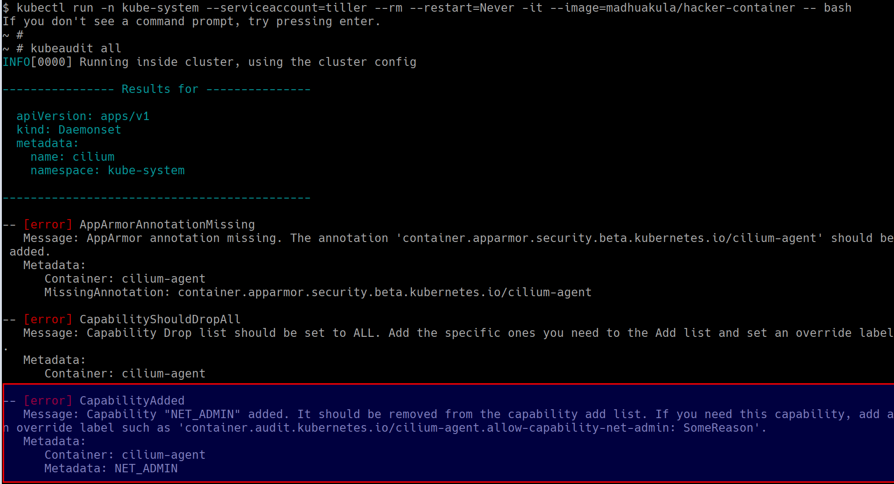

# ⎈ KubeAudit - Audit Kubernetes clusters

## 🙌 Overview

This scenario is very useful in performing Kubernetes security audits and assessments. Here we will learn to run an open-source tool called `kubeaudit` for the Kubernetes cluster and use the results for the further exploitation or fixing of the misconfigurations and vulnerabilities. This is very important and mandates if you are coming from an audit and compliance background in the modern world of containers, Kubernetes, and cloud native ecosystems.


By the end of the scenario, we will understand and learn the following

1. You will learn to perform Kubernetes audit for Kubernetes clusters
2. Working with open source utilities to perform audits and investigations of the cluster resources
3. Gain visibility of the entire Kubernetes cluster security posture and understand the risks

### ⚡️ The story

This scenario is mainly to perform the audit of the Kubernetes Cluster for various security concerns using the open-source tool `kubeaudit` by Shopify.

:::info

To get started with this scenario you can run the following command to start the `hacker-container` with cluster administrator privileges (as the tiller service account already has that)

```bash
kubectl run -n kube-system --serviceaccount=tiller --rm --restart=Never -it --image=madhuakula/hacker-container -- bash
```

:::


### 🎯 Goal

:::tip

The goal of this scenario is to perform the Kubernetes security audit and obtain the results from the audit.

:::

### 🪄 Hints & Spoilers

<details>
  <summary><b>✨ Not sure how to run the audit? </b></summary>
  <div>
    <div>Refer to <b>kubeaudit</b> command line utility. Also docs can be found at <a href="https://github.com/Shopify/kubeaudit">https://github.com/Shopify/kubeaudit</a> 🙌</div>
  </div>
</details>

## 🎉 Solution & Walkthrough

### 🎲 Method 1

:::info

`kubeaudit` is a command-line tool and a Go package to audit Kubernetes clusters for various security concerns, such as:

   * run as non-root
   * use a read-only root filesystem
   * drop scary capabilities, don't add new ones
   * don't run privileged
   * and more!

Refer to [https://github.com/Shopify/kubeaudit](https://github.com/Shopify/kubeaudit) for more details about the project

:::

* To get started with this scenario you can run the following command to start the `hacker-container` with cluster administrator privileges (as the tiller service account already has that)

```bash
kubectl run -n kube-system --serviceaccount=tiller --rm --restart=Never -it --image=madhuakula/hacker-container -- bash
```

* Run the `kubeaudit` in cluster mode. Kubeaudit can detect if it is running within a container in a cluster. If so, it will try to audit all Kubernetes resources in that cluster

```bash
kubeaudit all
```



* Now based on the vulnerabilities you see from the kubeaudit, you can proceed with further exploitation

* Hooray 🥳 , now we can see that it returns the all security issues/misconfigurations from the cluster

## 🔖 References

* [https://github.com/Shopify/kubeaudit](https://github.com/Shopify/kubeaudit)
