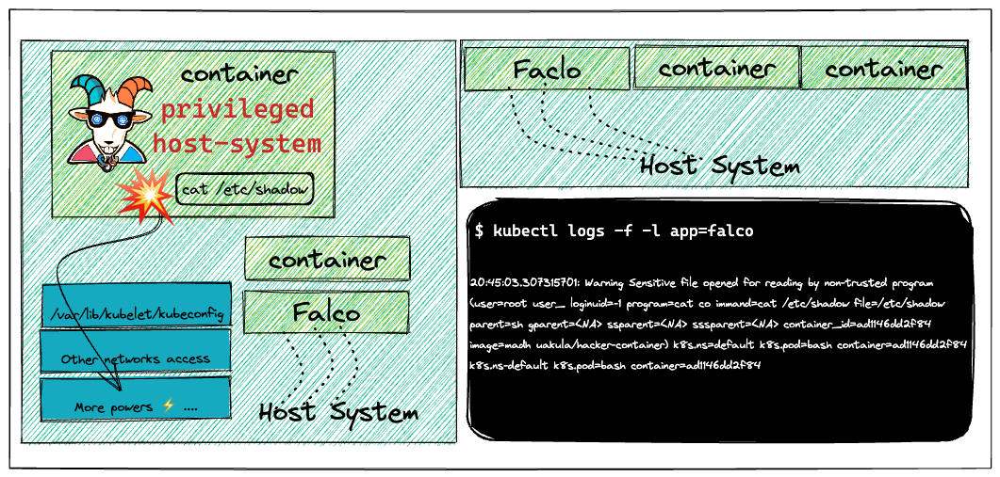
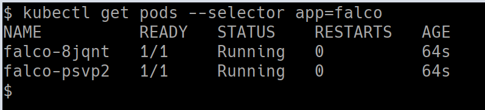
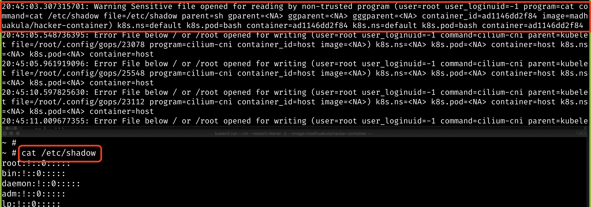

# ⎈ Falco - Runtime security monitoring & detection

## 🙌 Overview

The containers and their infrastructure are immutable. It means it's very difficult to detect certain attacks, vulnerabilities, and detections using traditional tools and technologies. In this scenario, we will see how we can leverage the popular open-source tool like Falco to detect and perform runtime security monitoring using the ruleset in action.



By the end of the scenario, we will understand and learn the following

1. Deploying the helm chart into the Kubernetes cluster
2. Performing the log analysis and detection of security events in the Kubernetes Cluster
3. Use, analyze and detect security issues in near real-time using Falco


### ⚡️ The story

This scenario is to deploy runtime security monitoring & detection for containers and Kubernetes resources. Also, explore and see how we can detect certain issues and perform detection rules analysis based on triggers.

:::note

Make sure you run the following deployment using Helm with v3. Refer to [helm installation](https://helm.sh/docs/helm/helm_install/)

:::

:::info

- To deploy the Falco helm chart run the following commands

```bash
helm repo add falcosecurity https://falcosecurity.github.io/charts
```

```bash
helm repo update
```

```bash
helm install falco falcosecurity/falco
```

:::


### 🎯 Goal

:::tip

Deploy the Falco and detect security events in near real-time using the pre-defined ruleset.

:::

### 🪄 Hints & Spoilers

<details>
  <summary><b>✨ Want to know more? </b></summary>
  <div>
    <div>I think it's best to refer to the official falco documentation <a href="https://falco.org/docs/">here</a> 🙌</div>
  </div>
</details>

## 🎉 Solution & Walkthrough

### 🎲 Method 1

:::info

`Falco`, the cloud-native runtime security project, is the de facto Kubernetes threat detection engine. Falco was created by Sysdig in 2016 and is the first runtime security project to join CNCF as an incubation-level project. Falco detects unexpected application behavior and alerts on threats at runtime.

:::

- Falco uses system calls to secure and monitor a system, by:

  - Parsing the Linux system calls from the kernel at runtime
  - Asserting the stream against a powerful rules engine
  - Alerting when a rule is violated

- Falco ships with a default set of rules that check the kernel for unusual behavior such as:

  - Privilege escalation using privileged containers
  - Namespace changes using tools like `setns`
  - Read/Writes to well-known directories such as /etc, /usr/bin, /usr/sbin, etc
  - Creating symlinks
  - Ownership and Mode changes
  - Unexpected network connections or socket mutations
  - Spawned processes using execve
  - Executing shell binaries such as sh, bash, csh, zsh, etc
  - Executing SSH binaries such as ssh, scp, sftp, etc
  - Mutating Linux coreutils executables
  - Mutating login binaries
  - Mutating shadowutil or passwd executables such as shadowconfig, pwck, chpasswd, getpasswd, change, useradd, etc, and others.

- Get more details about the Falco deployment by running the following command

```bash
kubectl get pods --selector app=falco
```



- Manually obtaining the logs from the Falco systems using the following command

```bash
kubectl logs -f -l app=falco
```

- Now, let's spin up a hacker container and read a sensitive file and see if that detects by Falco

```bash
kubectl run --rm --restart=Never -it --image=madhuakula/hacker-container -- bash
```

- Let's read the sensitive file `/etc/shadow`

```bash
cat /etc/shadow
```



- Hooray 🥳 , now we can see that Falco detected this and notified

## 🔖 References

- [https://falco.org/](https://falco.org/)
