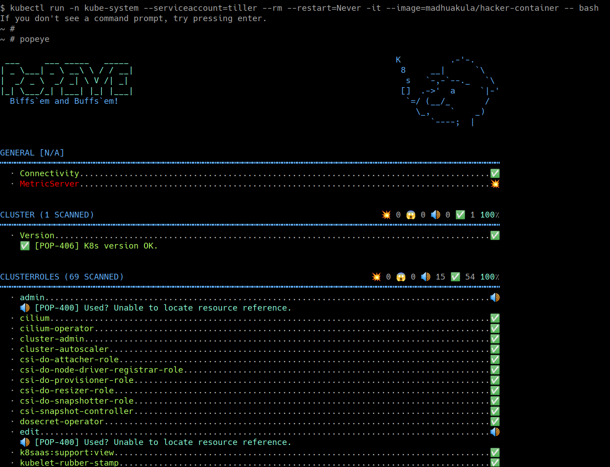

# ⎈ Popeye - A Kubernetes cluster sanitizer

## 🙌 Overview

This scenario is useful in performing Kubernetes security audits and assessments. Here you will learn how to run an open-source tool called `Popeye` for the Kubernetes cluster. You will also use the results for the further exploitation or fixing of the misconfigurations and vulnerabilities found. This is very important if you are coming from an audit and compliance background in the modern world of containers, Kubernetes, and cloud native ecosystems.


By the end of the scenario, you will understand and learn the following:

1. You will learn to perform Kubernetes audit for Kubernetes clusters
2. Working with open source utilities to perform audits and investigations of the cluster resources
3. Gain visibility of the entire Kubernetes cluster security posture and understand the risks

### ⚡️ The story

This scenario is mainly to perform the review of the Kubernetes Cluster by scanning the live Kubernetes cluster and reporting potential issues with deployed resources and configurations.

:::info

To get started with this scenario you can run the following command to start the `hacker-container` with cluster administrator privileges (as the tiller service account already has that)

```bash
kubectl run -n kube-system --serviceaccount=tiller --rm --restart=Never -it --image=madhuakula/hacker-container -- bash
```

:::

### 🎯 Goal

:::tip

The goal of this scenario is to perform the Kubernetes security audit and obtain the results from the audit.

:::

### 🪄 Hints & Spoilers

<details>
  <summary><b>✨ Not sure how to run the audit? </b></summary>
  <div>
    <div>Refer to <b>popeye</b> command line utility. Also docs can be found at <a href="https://popeyecli.io/">https://popeyecli.io</a> 🙌</div>
  </div>
</details>

## 🎉 Solution & Walkthrough

### 🎲 Method 1

:::info

`Popeye` is a utility that scans live Kubernetes clusters and reports potential issues with deployed resources and configurations. It sanitizes your cluster based on what's deployed and not what's sitting on the disk. Scanning your cluster helps detect misconfigurations and helps you to ensure that best practices are in place, thus preventing future headaches.

:::

* Here is a list of some of the available sanitizers
  * Node
  * Namespace
  * Pod
  * Service
  * ServiceAccount
  * Secrets
  * ConfigMap
  * Deployment
  * StatefulSet
  * DaemonSet
  * PersistentVolume
  * PersistentVolumeClaim
  * HorizontalPodAutoscaler
  * PodDisruptionBudget
  * ClusterRole
  * ClusterRoleBinding
  * Role
  * RoleBinding
  * Ingress
  * NetworkPolicy
  * PodSecurityPolicy

:::info

Refer to [https://github.com/derailed/popeye](https://github.com/derailed/popeye) for more details about the project

:::

* To get started with this scenario you can run the following command to start the `hacker-container` with cluster administrator privileges (as the tiller service account already has that)

```bash
kubectl run -n kube-system --serviceaccount=tiller --rm --restart=Never -it --image=madhuakula/hacker-container -- bash
```

* Run the `popeye` in the cluster by using cluster-admin token privileges

```bash
popeye
```



* Now based on the vulnerabilities you see from the Popeye, you can proceed with further exploitation

* Hooray 🥳 , now we can see that it returns the all security issues/misconfigurations from the cluster

## 🔖 References

* [Popeye - A Kubernetes Cluster Sanitizer](https://popeyecli.io/)
* [https://github.com/derailed/popeye](https://github.com/derailed/popeye)
