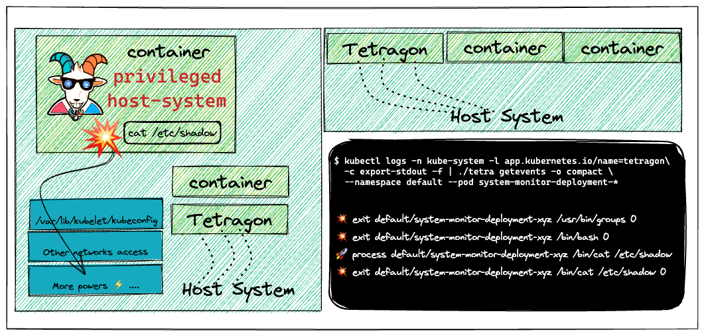
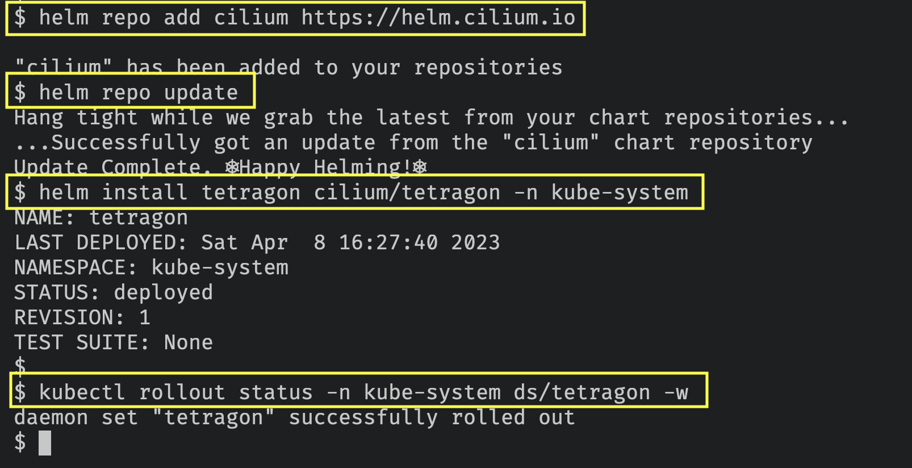
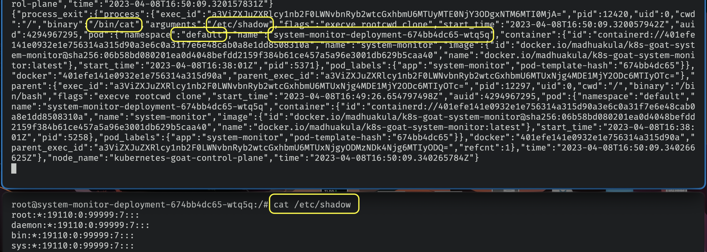
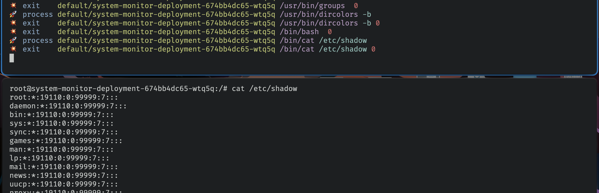
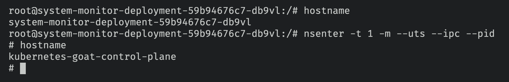
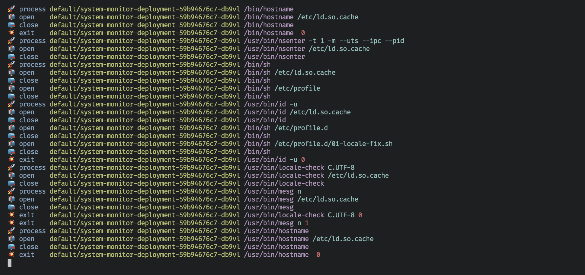

# ⎈ Cilium Tetragon - eBPF-based Security Observability and Runtime Enforcement

## 🙌 Overview

The containers and their infrastructure are immutable. It means it's very difficult to detect certain attacks, vulnerabilities, and detections using traditional tools and technologies. In this scenario, we will see how we can leverage the popular open-source tool like Cilium Tetragon to detect and perform runtime security monitoring using the `tracingpolicy` in action.



By the end of the scenario, we will understand and learn the following

1. Deploying the helm chart into the Kubernetes cluster
2. Performing the log analysis and detection of security events in the Kubernetes Cluster
3. Use, analyze and detect security issues in near real-time using Cilium Tetragon


### ⚡️ The story

This scenario is to deploy runtime security monitoring & detection for containers and Kubernetes resources. Also, explore and see how we can detect certain issues and perform detections using `tracingpolicy` based on attacker triggers.

:::note

Make sure you run the following deployment using Helm with v3. Refer to [helm installation](https://helm.sh/docs/helm/helm_install/)

:::

:::info

- To deploy the Cilium Tetragon helm chart run the following commands

```bash
helm repo add cilium https://helm.cilium.io
```

```bash
helm repo update
```

```bash
helm install tetragon cilium/tetragon -n kube-system
```

- You can verify that the Tetragon pods are in running state by running the following command

```bash
kubectl rollout status -n kube-system ds/tetragon -w
```

:::



### 🎯 Goal

:::tip

Deploy the Cilium Tetragon and detect security events in near real-time using the `tracingpolicy` and events.

:::

### 🪄 Hints & Spoilers

<details>
  <summary><b>✨ Want to know more? </b></summary>
  <div>
    <div>I think it's best to refer to the official Cilium Tetragon documentation <a href="https://github.com/cilium/tetragon">here</a> 🙌</div>
  </div>
</details>

## 🎉 Solution & Walkthrough

### 🎲 Method 1

:::info

Cilium’s new Tetragon component enables powerful realtime, eBPF-based Security Observability and Runtime Enforcement.

:::

Tetragon detects and is able to react to security-significant events, such as

- Process execution events
- System call activity
- I/O activity including network & file access

When used in a Kubernetes environment, Tetragon is Kubernetes-aware - that is, it understands Kubernetes identities such as namespaces, pods and so-on - so that security event detection can be configured in relation to individual workloads.

- Get more details about the Tetragon deployment by running the following command

```bash
kubectl get pods -n kube-system --selector app.kubernetes.io/instance=tetragon
```

- Manually obtaining the logs from the Tetragon using the following command

```bash
kubectl logs -n kube-system -l app.kubernetes.io/name=tetragon -c export-stdout -f 
```

- Now, let's use the system-monitor pod and try privileges escalation to the host system and see if that detects by Tetragon

```bash
export POD_NAME=$(kubectl get pods -l "app=system-monitor" -o jsonpath="{.items[0].metadata.name}")
kubectl exec -it $POD_NAME bash
```

- Let's read the sensitive file `/etc/shadow`

```bash
cat /etc/shadow
```



- You can also see these events in a nicer way using the official `tetra` cli client in your local system. Refer to the documentation for specific binary as per your [OS and Architecture](https://github.com/cilium/tetragon/releases)

```bash
wget https://github.com/cilium/tetragon/releases/download/v0.9.0/tetra-linux-amd64.tar.gz
tar -xvzf tetra-linux-amd64.tar.gz
```

- Now you can run the following command to pass the output of the Tetragon events to `tetra` cli locally to see in a nicer way

```bash
kubectl logs -n kube-system -l app.kubernetes.io/name=tetragon -c export-stdout -f | ./tetra getevents -o compact --namespace default --pod system-monitor-deployment-*
```



:::tip

`tetra` cli provides the context awareness of the Kubernetes, namespaces and other details like processes, etc. When querying you can even limit them to processes, namespace, pod, even regex supported.

:::

- Let's take a spin for detecting the privilege escalation attacks using the Tetragon. You can perform the container escape using the `system-monitor` pod to gain host system access by running the following commands

```bash
# Get into the system-monitor pod
export POD_NAME=$(kubectl get pods -l "app=system-monitor" -o jsonpath="{.items[0].metadata.name}")
kubectl exec -it $POD_NAME bash

# Exploit to gain the host system access using nsenter
nsenter -t 1 -m --uts --ipc --pid
```



- As you can see following, Tetragon in action detecting these attacks in near real-time

```bash
kubectl logs -n kube-system -l app.kubernetes.io/name=tetragon -c export-stdout -f | ./tetra getevents -o compact --namespace default --pod system-monitor-deployment-*
```



- Hooray 🥳 , now we can see that Tetragon detected the attack and notified using the events

## 🔖 References

- [https://github.com/cilium/tetragon](https://github.com/cilium/tetragon)
- [https://tetragon.cilium.io](https://tetragon.cilium.io)
