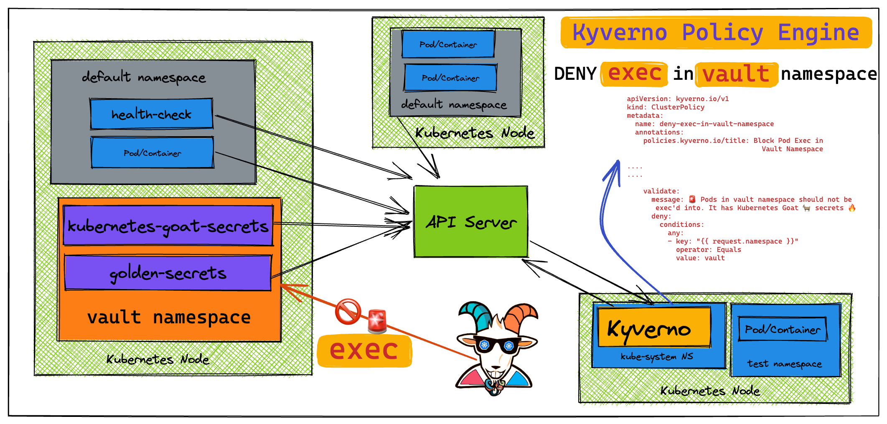
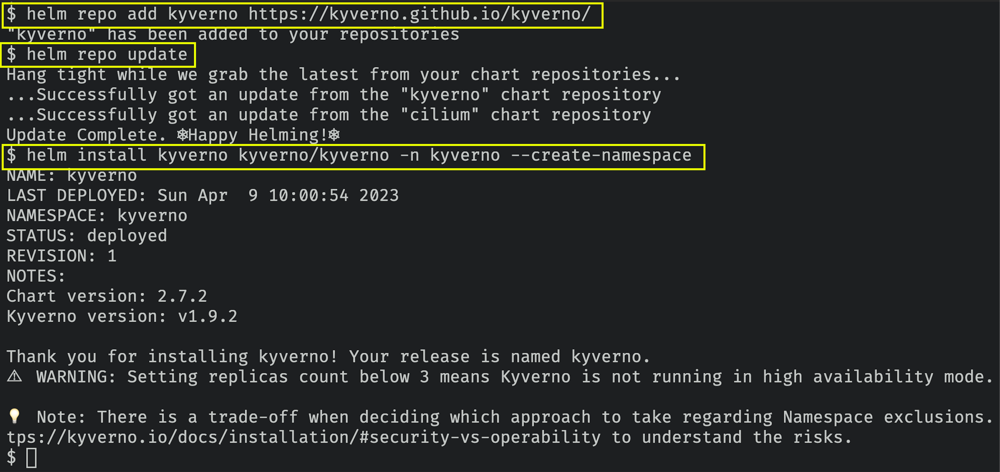
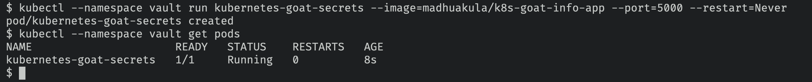
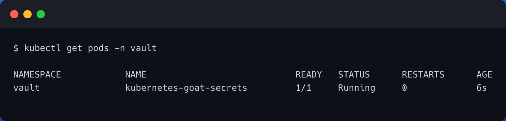
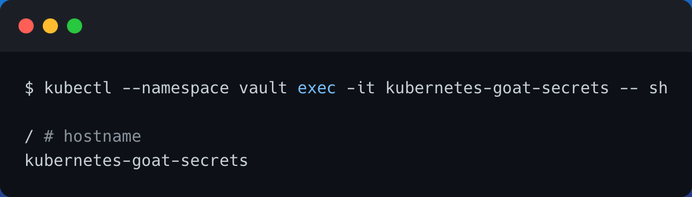
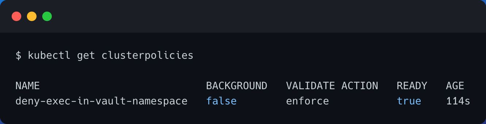
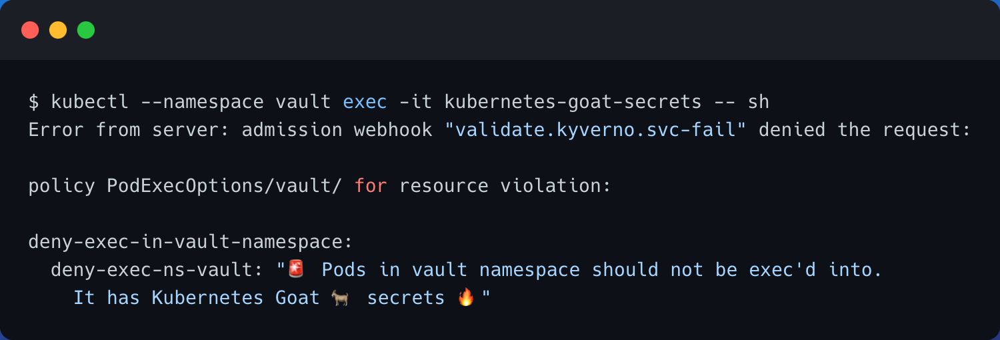

# ⎈ Securing Kubernetes Clusters using Kyverno Policy Engine

## 🙌 Overview

By this time you know that Kubernetes has various resources, configurations, and components. Most of the security risks come from security misconfigurations. As most organizations have various use cases, restrictions, risk acceptance, and guidelines. Kyverno enables this to codify their organizational policies into simple YAML files which can be loaded into Kubernetes clusters to validate and enforce the security best practices as per organization needs.

In this scenario, we will be looking at a simple use case of how you can create a Kyverno Policy to restrict anyone to `exec` into the pods using a simple Kyverno cluster policy in the `vault` namespace.



By the end of the scenario, you will understand and learn the following:

1. Deploying the Kyverno helm chart into the Kubernetes cluster
2. You will learn to work with Kyverno Policies in Kubernetes Cluster
3. Creating and destroying Kubernetes resources and applying security best practices using policies

### ⚡️ The story

This scenario is to deploy a simple Kyverno Policy for Kubernetes resources to restrict anyone to `exec` into the pods in `vault` namespace. Then validate this policy is enforced by trying to `exec` into the pod in `vault` namespace.

:::info

To get started with this scenario, create the `vault` namespace in your cluster using the following command.

```bash
kubectl create namespace vault
```

:::

### 🎯 Goal

:::tip

Create a Kyverno Policy to restrict anyone to `exec` into the pods using a simple Kyverno cluster policy in the `vault` namespace.

:::

- You can deploy the Kyverno Policy Engine into Kubernetes cluster by running the following helm chart commands

```bash
helm repo add kyverno https://kyverno.github.io/kyverno/
helm repo update
helm install kyverno kyverno/kyverno -n kyverno --create-namespace
```



### 🪄 Hints & Spoilers

<details>
  <summary><b>✨ What is Kyverno Policy and how to learn? </b></summary>
  <div>
    <div>Let's look at official docs <a href="https://kyverno.io/">Kyverno - Kubernetes Native Policy Management</a>.
      
  Also there are list of default sample Kyverno policies are available <a href="https://kyverno.io/policies/">here</a> 🙌</div>
  </div>
</details>

## 🎉 Solution & Walkthrough

**What is Kyverno?**

**Kyverno** (Greek for “govern”) is a policy engine designed specifically for Kubernetes.

`Kyverno` is a policy engine designed for Kubernetes. It can validate, mutate, and generate configurations using admission controls and background scans. Kyverno policies are Kubernetes resources and do not require learning a new language. Kyverno is designed to work nicely with tools you already use like `kubectl`, `kustomize`, and `Git`.

Here are some of its many features include from their website [https://kyverno.io/docs/introduction/](https://kyverno.io/docs/introduction/)

- policies as Kubernetes resources (no new language to learn!)
- validate, mutate, generate, or cleanup (remove) any resource
- verify container images for software supply chain security
- inspect image metadata
- match resources using label selectors and wildcards
- validate and mutate using overlays (like Kustomize!)
- synchronize configurations across Namespaces
- block non-conformant resources using admission controls, or report policy violations
- self-service reports (no proprietary audit log!)
- self-service policy exceptions
- test policies and validate resources using the Kyverno CLI, in your CI/CD pipeline, before applying to your cluster
- manage policies as code using familiar tools like git and kustomize

> Kyverno allows cluster administrators to manage environment specific configurations independently of workload configurations and enforce configuration best practices for their clusters. Kyverno can be used to scan existing workloads for best practices, or can be used to enforce best practices by blocking or mutating API requests.

### 🎲 Method 1

:::note

Refer to [https://kyverno.io/policies/](https://kyverno.io/policies/) for more policies examples and a detailed explanation of Kyverno Security Policies with details.

:::

- Let's run the Kubernetes Goat Secrets pod in the `vault` namespace

``` bash
kubectl --namespace vault run kubernetes-goat-secrets --image=madhuakula/k8s-goat-info-app --port=5000 --restart=Never
```



- We can verify that the `kubernetes-goat-secrets` pod is running in the `vault` namespace by running the following command

```bash
kubectl get pods -n vault
```



- Now let's try exec into the pod by running the following command

```bash
kubectl --namespace vault exec -it kubernetes-goat-secrets -- sh
```



- As you can clearly see that we can `exec` into the `kubernetes-goat-secrets` pod in `vault` namespace

- Given this is secure namespace and contains all the secrets related to the Kubernetes Goat. Let's create a Kyverno Policy and apply it to the Kubernetes cluster to block/deny any `exec` requests in `valut` namespace

```YAML title="kyverno-block-pod-exec-by-namespace.yaml"
apiVersion: kyverno.io/v1
kind: ClusterPolicy
metadata:
  name: deny-exec-in-vault-namespace
  annotations:
    policies.kyverno.io/title: Block Pod Exec in Vault Namespace
    policies.kyverno.io/category: Sample
    policies.kyverno.io/minversion: 1.6.0
    policies.kyverno.io/subject: Pod
    policies.kyverno.io/description: >-
      The `exec` command may be used to gain shell access, or run other commands, in a Pod's container. While this can
      be useful for troubleshooting purposes, it could represent an attack vector and is discouraged to use in the
      `vault` namespace. This policy blocks Pod exec commands to Pods in a Namespace called `vault`.
spec:
  validationFailureAction: enforce
  background: false
  rules:
  - name: deny-exec-ns-vault
    match:
      any:
      - resources:
          kinds:
          - PodExecOptions
    preconditions:
      all:
      - key: "{{ request.operation || 'BACKGROUND' }}"
        operator: Equals
        value: CONNECT
    validate:
      message: 🚨 Pods in vault namespace should not be exec'd into. It has Kubernetes Goat 🐐 secrets 🔥
      deny:
        conditions:
          any:
          - key: "{{ request.namespace }}"
            operator: Equals
            value: vault
```

- Let's deploy this Kyverno policy to the cluster by running the following command

```bash
kubectl apply -f https://raw.githubusercontent.com/madhuakula/kubernetes-goat/master/scenarios/kyverno-namespace-exec-block/kyverno-block-pod-exec-by-namespace.yaml
```

- Now, let's verify that the kyverno policy is applied and created in the Kubernetes Cluster

```bash
kubectl get clusterpolicies
```



- Now, let's retry the `exec` into the `kubernetes-goat-secrets` pod in `vault` namespace

```bash
kubectl --namespace vault exec -it kubernetes-goat-secrets -- sh
```



- As you can see the Kyverno Policy is blocking the `exec` into the `kubernetes-goat-secrets` pod in `vault` namespace. In general any pod in the `vault` namespace as per the policy we created

- You can remove all the applied resources and clean up by running the following commands

```bash
kubectl delete clusterpolicy deny-exec-in-vault-namespace
kubectl delete ns vault kyverno
```

- Hooray 🥳 , now you have successfully learned how to implement and work with Kyverno Policies in Kubernetes Clusters 🚀

:::tip

I think here we just touched the tip of the iceberg. There are a ton of amazing and powerful secure sane defaults we can enable with the power of Kyverno and policy engines in general.

There are many use cases like preventing security misconfigurations, building secure supply chain controls, enabling the Kubernetes cluster operators to codify the organizational security best practices, and applying them to clusters with the ease of YAML.

:::

## 🔖 References

- [Kyverno Website](https://kyverno.io/)
- [Kyverno Sample Policies](https://kyverno.io/policies/)
- [Kyverno GitHub Repository](https://github.com/kyverno/kyverno/)
