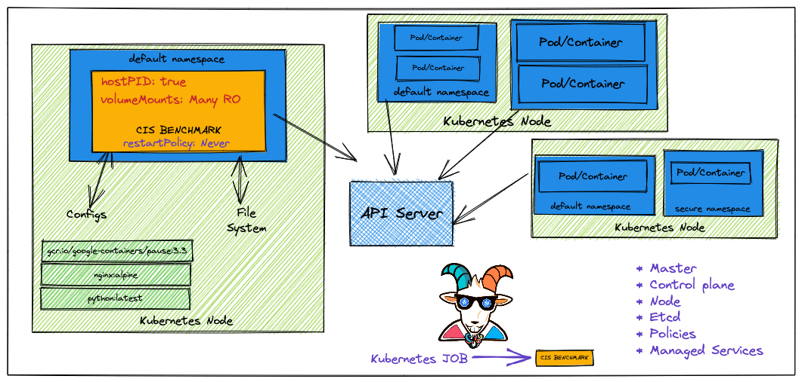
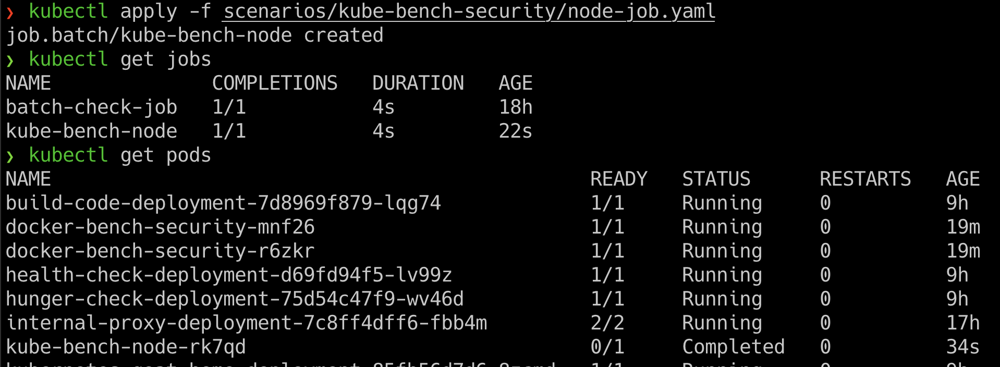
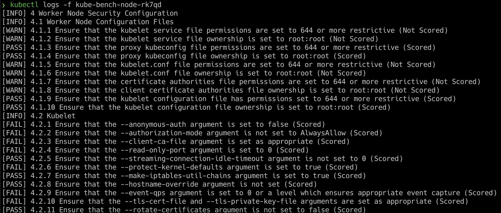

# ⎈ Kubernetes CIS benchmarks analysis

## 🙌 Overview

This scenario is very useful in performing Kubernetes security audits and assessments. Here we will learn to run the popular CIS benchmark audit for the Kubernetes cluster and use the results for the further exploitation or fixing of the misconfigurations and vulnerabilities. This is very important and mandates if you are coming from an audit and compliance background in the modern world of containers, Kubernetes, and cloud native ecosystems.



By the end of the scenario, we will understand and learn the following

1. You will learn to perform CIS benchmark audit for Kubernetes clusters
2. Working with jobs, Pods in Kubernetes, and other resources in the cluster
4. Gain visibility of the entire Kubernetes cluster security posture and understand the risks

### ⚡️ The story

This scenario is mainly to perform the Kubernetes CIS benchmarks analysis on top of Kubernetes nodes and cluster resources to identify the possible security vulnerabilities.

* To get started with this scenario you can either access the node and perform by following kube-bench security or run the following command to deploy kube-bench as [Kubernetes job](https://kubernetes.io/docs/concepts/workloads/controllers/job/)

:::info

* To get started with the scenario, you can deploy the Kubernetes CIS benchmarks job using the following commands

```bash
kubectl apply -f scenarios/kube-bench-security/node-job.yaml
```

```bash
kubectl apply -f scenarios/kube-bench-security/master-job.yaml
```

:::


### 🎯 Goal


:::tip

The goal of this scenario is to perform the Kubernetes CIS benchmark audit and obtain the results from the audit.

:::

### 🪄 Hints & Spoilers

<details>
  <summary><b>✨ Not sure how to run the audit? </b></summary>
  <div>
    <div>Refer to <b>kube-bench</b> directory and manifests. Also docs can be found here <a href="https://github.com/aquasecurity/kube-bench">https://github.com/aquasecurity/kube-bench</a> 🙌</div>
  </div>
</details>

## 🎉 Solution & Walkthrough

### 🎲 Method 1

* We can deploy the Kubernetes CIS benchmarks by running the following command

```bash
kubectl apply -f scenarios/kube-bench-security/node-job.yaml
```

* Now we can obtain the list of jobs and associated pods information by running the following command

```
kubectl get jobs
```

```bash
kubectl get pods
```



* Once we have identified the pod, then we can get the audit results by running the following command. Make sure to replace the pod name in the following command

```bash
kubectl logs -f kube-bench-node-xxxxx
```



* Now based on the vulnerabilities you see from the Kubernetes CIS benchmarks, you can proceed with further exploitation

* Hooray 🥳 , now we can see that it returns the all security issues/misconfigurations from the cluster

## 🔖 References

* [kube-bench](https://github.com/aquasecurity/kube-bench)
* [CIS Benchmarks for Kubernetes](https://www.cisecurity.org/benchmark/kubernetes)
