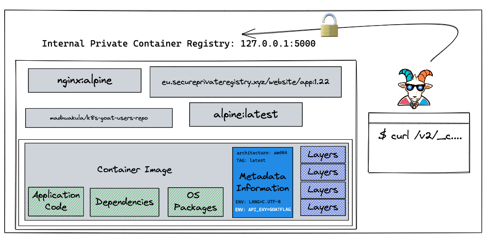
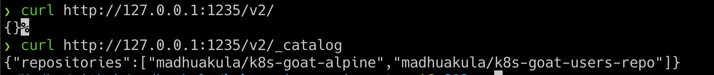
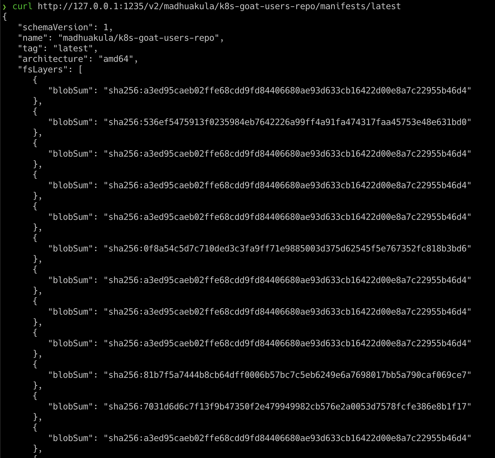

# ⎈ Attacking private registry

## 🙌 Overview

In this scenario, we will see one of the misconfigurations of Docker container private registries and how we can obtain and gain access to the images and their content. There was a popular hack around this in the early days of containers where vine (Twitter acquired now) got hacked and the entire source code of the product was leaked due to this simple misconfiguration. Also, we see a ton of similar cases even today but with authenticated registries as well and misconfigured permissions and privileges.



By the end of the scenario, we will understand and learn the following

1. How to interact with Docker container registry API
2. Able to introspect the container registry API, container images, and manifests
3. Understand how container metadata gets stored and interacts with the layers

### ⚡️ The story

A container registry is a place where all the container images get pushed. Most of the time each organization has its own private registry. Also sometimes it ends up misconfigured, public/open. On the other hand, developers assume that their internal private registry is only for internal and end up storing all the sensitive information inside the container images. Let's see what we can find here.

:::info

To get started with the scenario, navigate to [http://127.0.0.1:1235](http://127.0.0.1:1235)

:::


### 🎯 Goal

:::tip

To complete this scenario you need to obtain the `k8s-goat-FLAG` flag value in the private registry images.

:::

### 🪄 Hints & Spoilers

<details>
  <summary><b>✨ Still looking at the website? </b></summary>
  <div>
    <div>Refer to the Docker container registry API documentation, and see how to query the REST API 🙌</div>
  </div>
</details>

<details>
  <summary><b>✨ Found the container image? </b></summary>
  <div>
    <div>Checkout the manifests file for all the metadata, variables, information and who knows may be flag as well 🎉</div>
  </div>
</details>

## 🎉 Solution & Walkthrough

### 🎲 Method

:::note

As this is an intentionally vulnerable design, we directly provided the endpoint. In the real world, you have to do some recon or even need to exploit the authenticated registries by a combination of other vulnerabilities chains.

:::

* Based on the scenario and information, we can identify that it's possible docker container private registry

* After reading some documentation and googling, here are the simple API endpoint queries for talking to the container registry

* To query the registry API v2

```bash
curl http://127.0.0.1:1235/v2/
```

* The following endpoint is to query the catalog information, which returns all the details of images available in the container registry

```bash
curl http://127.0.0.1:1235/v2/_catalog
```



* We can get more information about the specific image using the image name with a tag with a manifest endpoint

```bash
curl http://127.0.0.1:1235/v2/madhuakula/k8s-goat-users-repo/manifests/latest
```



* Now we can see this container image has ENV variables that contain API key information, so we can quickly `grep` that out

```bash
curl http://127.0.0.1:1235/v2/madhuakula/k8s-goat-users-repo/manifests/latest | grep -i env 
```


:::tip

This can be taken a little further by using the `docker` client to download the images locally and analyzing. Also in some cases, you can even push the image to the registry based on the permissions and privileges.

:::

* Hooray 🥳 , now we can see that it contains Kubernetes Goat flag

## 🔖 References

* [Docker Registry HTTP API V2](https://docs.docker.com/registry/spec/api/)
* [Twitter's Vine Source code dump](https://avicoder.me/2016/07/22/Twitter-Vine-Source-code-dump/)
