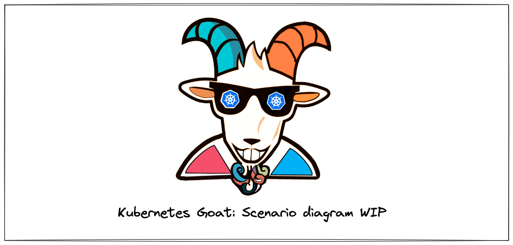
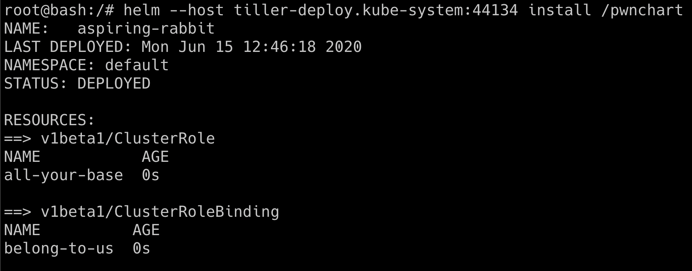

# ⎈ Helm v2 tiller to PwN the cluster - [Deprecated]

:::warning

This scenario has been deprecated from the Kubernetes Goat and read-only documentation is available to learn 😊

:::

## 🙌 Overview

This is one of the early days of Kubernetes package manager configuration mistakes. Helm is a package manager for Kubernetes to deploy and manage applications, the default configuration and setup is insecure that if an attacker has access to any one of the pod and there were no network security policies (NSP) the attacker can gain complete cluster access and take over the cluster-admin privileges.



By the end of the scenario, we will understand and learn the following

1. You will learn to work with Kubernetes services and helm package manager
2. Understand how to deploy helm charts into the Kubernetes cluster and manage them
3. Exploit the misconfigurations and take over the complete Kubernetes cluster access

### ⚡️ The story

Helm is a package manager for Kubernetes. It's like `apt-get` for ubuntu. In this scenario, we will see the older version of helm (version 2), tiller service RBAC default setup to gain access to the completed cluster.

:::info

- To get started with the scenario, run the following command

```bash
kubectl run --rm --restart=Never -it --image=madhuakula/k8s-goat-helm-tiller -- bash
```
:::


### 🎯 Goal

:::tip

To successfully complete this scenario, you need to gain cluster-admin privileges of the Kubernetes Cluster and be able to get the secrets of the `kube-system` namespace from the pod you are inside.

:::

### 🪄 Hints & Spoilers

<details>
  <summary><b>✨ Still figuring the helm tiller service? </b></summary>
  <div>
    <div>Always read the docs, look for the default tiller port and service name 🙌</div>
  </div>
</details>

<details>
  <summary><b>✨ I found tiller, but how can I gain cluster-admin access? </b></summary>
  <div>
    <div>Refer to the pwn-chart in your container, it has pre-built helm chart to gain full cluster-admin access to the current pod you are working on 🎉</div>
  </div>
</details>

## 🎉 Solution & Walkthrough

### 🎲 Method

:::info

By default helm version 2 has a tiller component, which has full cluster administration RBAC privileges 🔥

:::
  
- So the default installation of the tiller is in the `kube-system` namespace with service name `tiller-deploy` and port `44134`. Which expose to `0.0.0.0` address, we can verify by running a simple telnet command

```bash
telnet tiller-deploy.kube-system 44134
```


- Now, we are able to connect to the tiller service port. We can use the helm binary to perform operations and talk to the tiller service

```bash
helm --host tiller-deploy.kube-system:44134 version
```


- Let's try if we can get Kubernetes secrets from the cluster from the `kube-system` namespace before we deploy the `pwn-chart`

```bash
kubectl get secrets -n kube-system
```


- As you can see we can't get access to the `kube-system` namespace secrets by default. Now we can create our own helm chart to give permissions to `default` ServiceAccount with full cluster-admin access. By default the current pod deployed in the `default` namespace which has the `default` ServiceAccount, so we end up getting the full cluster-admin privileges in the current pod only 🥳

```bash
helm --host tiller-deploy.kube-system:44134 install --name pwnchart /pwnchart
```



- Now the `pwnchart` has been deployed with the help of helm and tiller service, it will give all the default service accounts cluster-admin access. Hence let's try getting the `kube-system` namespace secrets again

```bash
kubectl get secrets -n kube-system
```


:::info

This scenario varies how the tiller deployment has been performed, sometimes admins deploy the tiller to a specific namespace with a specific privilege. Also from Helm version 3, there is no tiller service to mitigate such vulnerabilities
:::

- Hooray 🥳 , this is one heck of a default misconfiguration to gain complete cluster take over

## 🔖 References

- [Exploring the Security of Helm](https://docs.bitnami.com/tutorials/exploring-helm-security)
