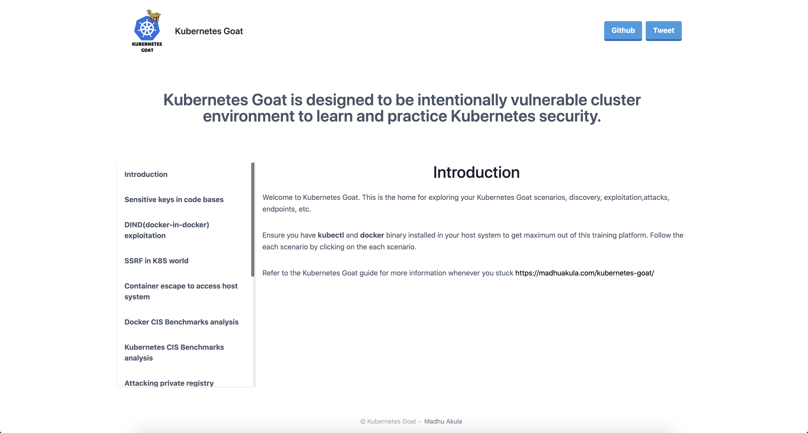

# About Kubernetes Goat

[Kubernetes Goat](https://github.com/madhuakula/kubernetes-goat) is designed to be an intentionally vulnerable cluster environment to learn and practice Kubernetes security.

## Disclaimer & Warnings

> Kubernetes Goat creates intentionally vulnerable resources into your cluster. DO NOT deploy Kubernetes Goat in a production environment or alongside any sensitive cluster resources.

## Kubernetes Goat Scenarios

1. [Sensitive keys in code bases](scenarios/scenario-1.md)
2. [DIND (docker-in-docker) exploitation](scenarios/scenario-2.md)
3. [SSRF in K8S world](scenarios/scenario-3.md)
4. [Container escape to access host system](scenarios/scenario-4.md)
5. [Docker CIS Benchmarks analysis](scenarios/scenario-5.md)
6. [Kubernetes CIS Benchmarks analysis](scenarios/scenario-6.md)
7. [Attacking private registry](scenarios/scenario-7.md)
8. [NodePort exposed services](scenarios/scenario-8.md)
9. [Helm v2 tiller to PwN the cluster](scenarios/scenario-9.md)
10. [Analysing crypto miner container](scenarios/scenario-10.md)
11. [Kubernetes Namespaces bypass](scenarios/scenario-11.md)
12. [Gaining environment information](scenarios/scenario-12.md)
13. [DoS the memory/cpu resources](scenarios/scenario-13.md)
14. [Hacker Container preview](scenarios/scenario-14.md)
15. [Hidden in layers](scenarios/scenario-15.md)
16. [RBAC Least Privileges Misconfiguration](scenarios/scenario-16.md)

## Kubernetes Goat Architecture

TBD

## Author

Kubernetes Goat was created by [Madhu Akula](https://madhuakula.com)

[Madhu Akula](https://madhuakula.com) is a security ninja, published author, and cloud native security architect with an extensive experience. Also, he is an active member of the international security, devops and cloud native communities ([null, DevSecOps, AllDayDevOps, etc](https://madhuakula.com#volunteering)). Holds industry [certifications](https://madhuakula.com#accomplishments) like OSCP (Offensive Security Certified Professional), CKA (Certified Kubernetes Administrator), etc. Madhu frequently [speaks and runs training sessions](https://madhuakula.com/talk/) at security events and conferences around the world including DEFCON (24, 26 & 27), BlackHat USA (2018 & 19), USENIX LISA (2018 & 19), O’Reilly Velocity EU 2019, GitHub Satellite 2020, Appsec EU (2018 & 19), All Day DevOps (2016, 17, 18, 19 & 20), DevSecCon (London, Singapore, Boston), DevOpsDays India, c0c0n(2017, 18), Nullcon (2018, 19), SACON 2019, Serverless Summit, null and multiple others. His research has identified vulnerabilities in over 200+ companies and organizations including; Google, Microsoft, LinkedIn, eBay, AT&T, WordPress, NTOP and Adobe, etc and credited with multiple [CVE’s](https://madhuakula.com/publication/security-vulnerabilities-advisories/), [Acknowledgements](https://madhuakula.com/publication/security-vulnerabilities-acknowledgements/) and rewards. He is co-author of [Security Automation with Ansible2](https://www.secautomationbook.com/) (ISBN-13: 978-1788394512), which is listed as a technical resource by [Red Hat Ansible](https://www.ansible.com/resources/ebooks/security-automation-with-ansible-2). Also won 1st prize for building an infrastructure security monitoring solution at [InMobi flagship hackathon](https://inmobihackdaysummer2015.devpost.com) among 100+ engineering teams.
