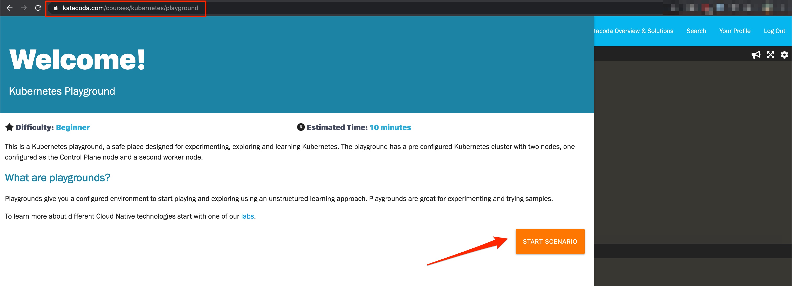
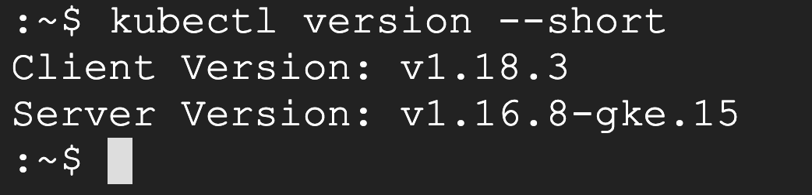

# Kubernetes Cluster Setup

Before we setup the Kubernetes Goat, we need to have working Kubernetes cluster admin access.

There are many ways you can run the Kubernetes Cluster. Some of them includes running in

* Cloud provider Kubernetes service (like GKE, EKS, AKS, DO, etc.)
* Locally provisioned cluster
* Minikube environnement
* Katacoda Playground


Refer to the Kubernetes setup documentation for more information and details at [https://kubernetes.io/docs/setup/](https://kubernetes.io/docs/setup/)

## Kubernetes playground by Katacoda

[](https://www.katacoda.com/courses/kubernetes/playground)

**[https://www.katacoda.com/courses/kubernetes/playground](https://www.katacoda.com/courses/kubernetes/playground)**

## Verify that you have Kubernetes cluster access

```bash
kubectl version --short
```



> If you can see both client and server version information when you run the above command, you have access to the Kubernetes Cluster.
