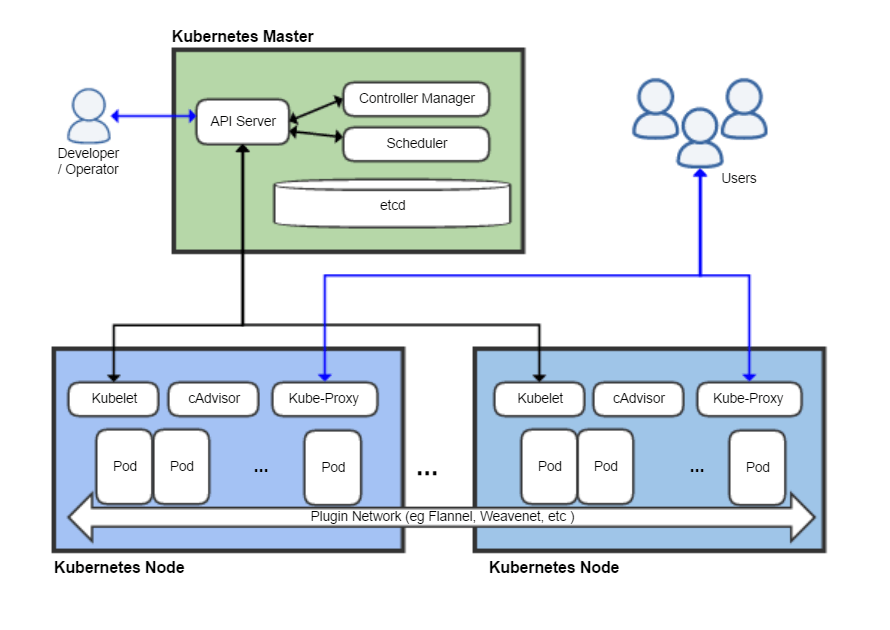

# Learning Kubernetes

> Kubernetes is an open-source container-orchestration system for automating application deployment, scaling, and management. It was originally designed by Google and is now maintained by the Cloud Native Computing Foundation. - Wikipedia

## What is Kubernetes - The Illustrated Children's Guide to Kubernetes

source: [https://www.youtube.com/watch?v=4ht22ReBjno](https://www.youtube.com/watch?v=4ht22ReBjno)

## Kubernetes Overview

Image source: Khtan66 [CC BY-SA 4.0](https://creativecommons.org/licenses/by-sa/4.0"), [from Wikimedia Commons](https://commons.wikimedia.org/wiki/File:Kubernetes.png)

## Resources to learn more about Kubernetes

* [Kubernetes Docs](https://kubernetes.io/docs/home/)
* [Kubernetes Tutorials](https://kubernetes.io/docs/tutorials/)
* [Kubernetes by Examples](https://kubernetesbyexample.com/)
