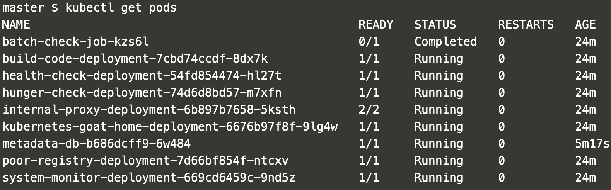

# Scenarios

Welcome to Kubernetes Goat Scenarios. This is the home for exploring your Kubernetes Goat scenarios, discovery, exploitation, attacks, endpoints, etc.

Ensure you have `kubectl` and `docker` binary installed in your host system to get maximum out of this training platform. Follow each scenario by clicking on the scenario.

## Access the Kubernetes Goat environment resources

* Ensure the pods are in running state before running the access script

```bash
kubectl get pods
```



* Run the following script to access the environment

```bash
bash access-kubernetes-goat.sh
```

* Then navigate to [http://127.0.0.1:1234](http://127.0.0.1:1234)


## Flags looks like below

> The flag format looks like `k8s-goat-2912d3d0b262bb16afbe450034089463`

## List of Scenarios

1. [Sensitive keys in code bases](scenario-1.md)
2. [DIND (docker-in-docker) exploitation](scenario-2.md)
3. [SSRF in K8S world](scenario-3.md)
4. [Container escape to access host system](scenario-4.md)
5. [Docker CIS Benchmarks analysis](scenario-5.md)
6. [Kubernetes CIS Benchmarks analysis](scenario-6.md)
7. [Attacking private registry](scenario-7.md)
8. [NodePort exposed services](scenario-8.md)
9. [Helm v2 tiller to PwN the cluster](scenario-9.md)
10. [Analysing crypto miner container](scenario-10.md)
11. [Kubernetes Namespaces bypass](scenario-11.md)
12. [Gaining environment information](scenario-12.md)
13. [DoS the memory/cpu resources](scenario-13.md)
14. [Hacker Container preview](scenario-14.md)
