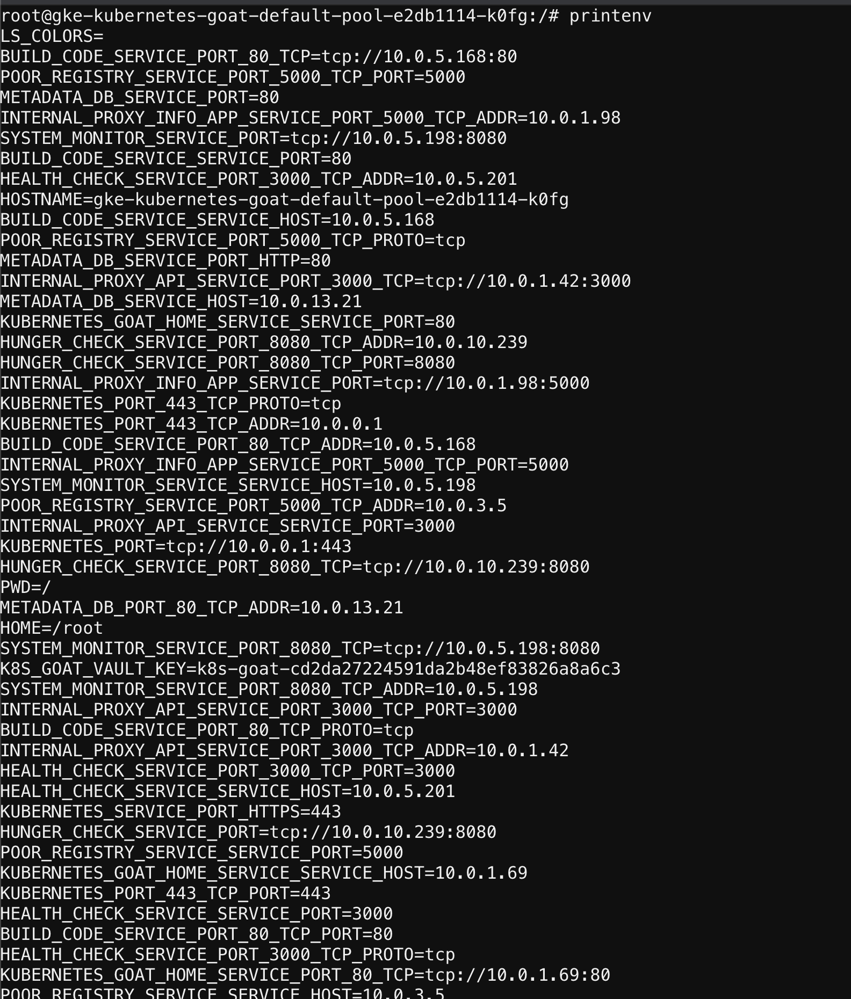

# Gaining environment information

## Scenario Information

Each environment in Kubernetes will have a lot of information to share. Some of the key things include secrets, api keys, configs, services, and a lot more. So let's go ahead and find the vault key!

* To get started with the scenario, navigate to [http://127.0.0.1:1233](http://127.0.0.1:1233)


## Scenario Solution

* Go ahead and explore the system as a generic linux system

```bash
cat /proc/self/cgroup
cat /etc/hosts
mount
ls -la /home/
```


* Getting the environment variables, including Kubernetes secrets mounted `K8S_GOAT_VAULT_KEY=k8s-goat-cd2da27224591da2b48ef83826a8a6c` and service names, ports, etc.

```bash
printenv
```



## Miscellaneous

TBD
