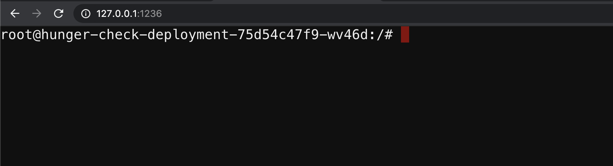
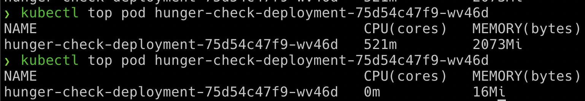

# DoS the memory/CPU resources

## Scenario Information

There is no specification of resources in the Kubernetes manifests and not applied limit ranges for the containers. As an attacker, we can consume all the resources where the pod/deployment running and starve other resources and cause a DoS for the environment.

* To get started with the scenario, navigate to [http://127.0.0.1:1236](http://127.0.0.1:1236)



## Scenario Solution

* This deployment pod has not set any resource limits in the Kubernetes manifests. So we can easily perform the bunch of operations which can consume resources
* In this pod we have installed a utility called `stress-ng`

```bash
stress-ng --vm 2 --vm-bytes 2G --timeout 30s
```


* You can see the difference between while running `stress-ng` and after

```bash
kubectl --namespace big-monolith top pod hunger-check-deployment-xxxxxxxxxx-xxxxx
```



> This attack may not work in some cases like autoscaling, resource restrictions, etc.

## Miscellaneous

TBD
