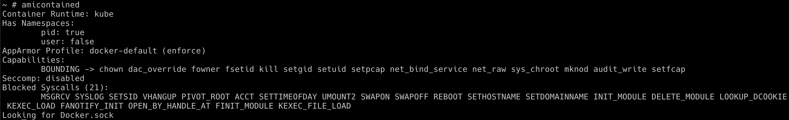

# Hacker Container preview

## Scenario Information

This scenario is just an exploration of the common security utilities inside the Kubernetes Cluster environment. I think by this time you might have already used hacker-container multiple times.

* To get started with this scenario. Run the hacker container using the below command

```bash
kubectl run -it hacker-container --image=madhuakula/hacker-container -- sh
```


## Scenario Solution

Hacker Container is a utility with the list of useful tools/commands while hacking Kubernetes Clusters. So there is not limit to your exploration with Kubernetes environments. Here we will see some of the most useful and powerful utilities

* Container introspection utility to get an overview of the system capabilities, etc.

```bash
amicontained
```



* Performing Nikto scan against internal services

```bash
nikto.pl -host http://metadata-db
```


> There are many other use cases. To get the maximum out of hacker-container, we can use with host privileges, volumes, process, etc. Will be updated soon with more details.

## Miscellaneous

TBD
