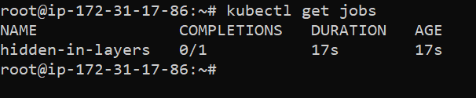
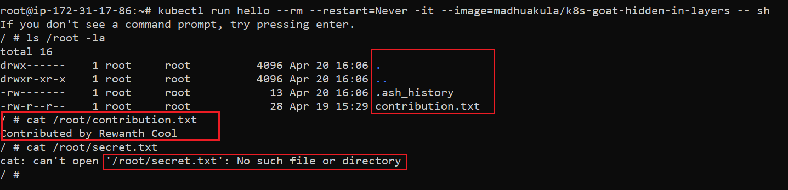

# Hidden in layers

## Scenario Information

Sensitive information disclosure is one of the most common vulnerability existing in the wild. Mishandling of passwords, private keys, tokens, etc in containerization world is easy. Here in this scenario, we will analyze and identify one of such mishandled bad practice that leads to sensitive information disclosure.

* To get started with the scenario, run the following command

<!-- ```bash
kubectl run hidden-in-layers --rm --restart=Never -it --image=madhuakula/k8s-goat-hidden-in-layers -- sh
``` -->

```bash
kubectl get jobs
```




## Scenario Solution

> Try exploring all files, environment variables, etc in the running container. Next, try to analyze the image used above with different tools to find exposed sensitive information.

* Docker cli is an amazing tool with lots of features. Let's start with inspecting the image.

```bash
docker inspect madhuakula/k8s-goat-hidden-in-layers 
```


Observe the `cmd` section in the above output. It shows the default command executed by this image on startup. Though this shows some interesting information, but its not good enough for us.

Maybe it would be more helpful for us if we get to know how this image is built from scratch. For that we need to analyze the dockerfile of the image. If you have dockerfile, its good. If not, there are a few ways to analyze it.

### Method 1 (docker history)

```bash
docker history --no-trunc madhuakula/k8s-goat-hidden-in-layers
```


### Method 2 (generates dockerfile from image)

`alpine/dfimage` generates dockerfile of any given image.

```bash
alias dfimage="docker run -v /var/run/docker.sock:/var/run/docker.sock --rm alpine/dfimage"
```
Let's set an alias. Next, we will run this with the image we want to analyze

```bash
dfimage -sV=1.36 madhuakula/k8s-goat-hidden-in-layers
```


### Method 3 (using dive)

[`Dive`](https://github.com/wagoodman/dive) is an amazing tool that helps with analyzing each layer of an image.


From all the above analyzations, we can see some significant changes in these two files, `/root/contributions.txt`, `/root/secret.txt`. The above methods cannot help us to read contents of these files. Let's see if we can find these files in the running container.



We can't see `/root/secret.txt` as it is deleted the next layers. Our task is to recover the `/root/secret.txt`.

Again, docker cli for rescue. Export the docker image as a tar file.

```bash
docker save madhuakula/k8s-goat-hidden-in-layers -o hidden-in-layers.tar
```

Now, extract the tar file.

```bash
tar xvf hidden-in-layers.tar
```


We can see each layer getting exported as a single tar file. We have 3 layers in this image, so we have 3 tar files. Since, we have only 3 layers, its easy to extract all of them and check the contents but that's not the conventional approach. What if we have hunderds of layers?

Let's review the dive output again. In the below image, we saw a new file, `/root/secret.txt` is being created. 


Observe the `Id` of that layer, `da73da4359e9edb793ee5472ae3538be8aec57c27efff7dae8873566c865533f`. Since, we have `/root/secret.txt` created in this layer, let's extract the tar file of this layer first.

```bash
cd da73da4359e9edb793ee5472ae3538be8aec57c27efff7dae8873566c865533f
tar xvf layer.tar
cat root/secret.txt
```


Woot, we found a flag. Congratulations.

## Miscellaneous

[Digging into docker layers](https://jessicagreben.medium.com/digging-into-docker-layers-c22f948ed612)
