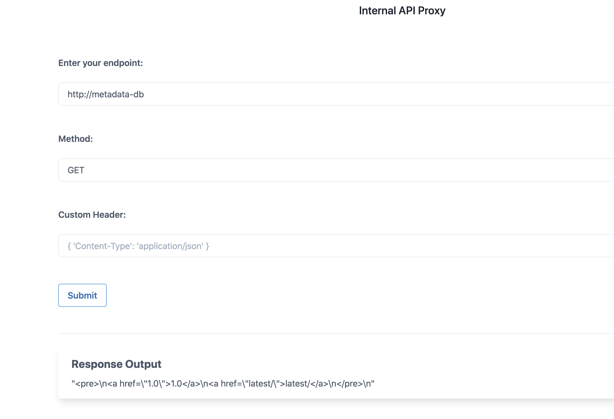
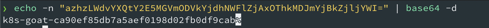

# SSRF in K8S world

## Scenario Information

SSRF (Server Side Request Forgery) vulnerability became the go-to attack for cloud native environments. Here in this scenario, we will see how we can exploit an application vulnerability like SSRF to gain access to cloud instance metadata as well as internal services metadata information.

* To get started with the scenario, navigate to [http://127.0.0.1:1232](http://127.0.0.1:1232)


## Scenario Solution

> Based on the description, we know that this application possibly vulnerable to the SSRF vulnerability. Let's go ahead and access the default instance metadata service using `169.254.169.254`. Identify which cloud provider you are running this service, then use specific headers, and queries.

* Let's also run and see what all ports running with in the same pod/container. The endpoint is `http://127.0.0.1:5000` and method `GET`


* Now we can see that there is an internal-only exposed service with-in the cluster called `http://metadata-db`



* After enumerating through the entire key values, finally identified the flag at `http://metadata-db/latest/secrets/kubernetes-goat`


* Then decoding the base64 returns the flag as `k8s-goat-ca90ef85db7a5aef0198d02fb0df9cab`

```bash
echo -n "azhzLWdvYXQtY2E5MGVmODVkYjdhNWFlZjAxOThkMDJmYjBkZjljYWI=" | base64 -d
```



## Miscellaneous

TBD
