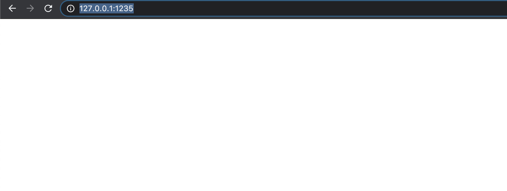
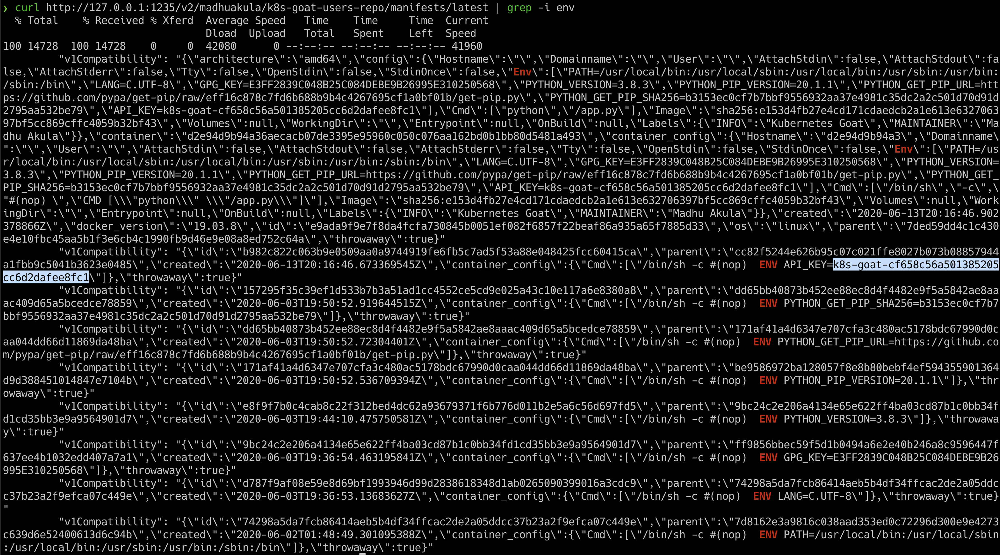

# Attacking private registry

## Scenario Information

A container registry is a place where all the container images get pushed. Most of the time each organization has its own private registry. Also sometimes it ends up misconfigured, public/open. On the other hand, developers assume that their internal private registry only and end up storing all the sensitive information inside the container images. Let's see what we can find here.

* To get started with the scenario, navigate to [http://127.0.0.1:1235](http://127.0.0.1:1235)



## Scenario Solution

> As this is an intentionally vulnerable design, we directly provided the endpoint. In the real-world you have to do some recon.

* Based on the scenario and information, we identified that it's possible docker container private registry

* After reading some docs and googling, here are the simple API endpoint queries for the container registry

```bash
curl http://127.0.0.1:1235/v2/
curl http://127.0.0.1:1235/v2/_catalog
```


* Get more information about the images inside the registry from the API using below queries

```bash
curl http://127.0.0.1:1235/v2/madhuakula/k8s-goat-users-repo/manifests/latest
```


* Now, we observed that the docker container has ENV variable with API key information

```bash
```



> This can be taken a little further by using the `docker` client to download the images locally and analysing. Also in some cases you can even push the image to the registry based on the permissions and privileges

## Miscellaneous

TBD
