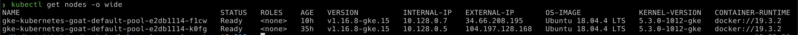
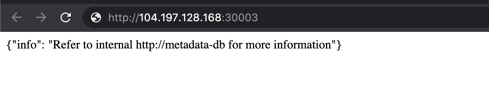

# NodePort exposed services

## Scenario Information

If any of the users exposed any service within the Kubernetes cluster with `NodePort`, this means if the nodes where the Kubernetes clusters running doesn't have any firewall/network security enabled. We need to see some unauthenticated and unauthorized services.

* To get started with the scenario, run the following command and look for open ports in the Kubernetes Nodes

```bash
kubectl get nodes -o wide
```

> When Kubernetes creates a NodePort service, it allocates a port from a range specified in the flags that define your Kubernetes cluster. (By default, these are ports ranging from 30000-32767.)

## Scenario Solution

* Get the list of Kubernetes nodes external IP addresses information

```bash
kubectl get nodes -o wide
```



* Now, let's find out the open port. In this case, you can use your traditional security scanning utilities like `Nmap`

* Once we identified that there is a NodePort exposed, we can just verify by connecting to it and access

```bash
nc -zv EXTERNAL-IP-ADDRESS 30003
```



> This vulnerability/attack varies depends on how the Kubernetes cluster has been configured

## Miscellaneous

TBD
